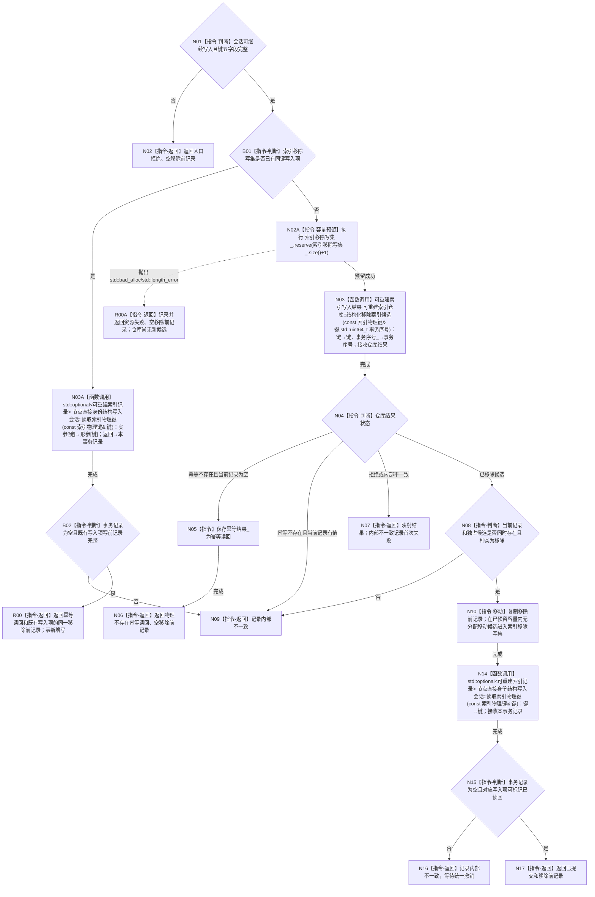

# CR-F13 会话移除索引候选单函数施工流程图

日期：2026-07-30
版本：v0.1
代码基线：`57866ac5ca63235ed12da60f635d29f1aacd718b`

## 依据与身份

依据：业务图 B09、B11；函数功能确认 CR-F13；逐节点分析 CR-F13；详细设计 §4.2—§4.3、§5、§7。
本图是待实现目标函数的正式施工图。

## 函数合同

```text
根函数：移除索引候选
归属：海中鱼巣.核心.会话.节点直接身份结构写入 / 核心/会话.节点直接身份结构写入.ixx / 会话编排层公开成员
完整签名：节点直接身份索引移除结果 节点直接身份结构写入会话::移除索引候选(const 索引物理键& 键)
参数：键，const 索引物理键&，只借用到返回；五字段完整；调用方保有所有权。
返回：节点直接身份索引移除结果，值归调用方。
- 已提交：移除前记录必须有值，候选唯一移入索引移除写集且事务读取已证明不命中。
- 幂等读回：同事务已经登记该键时返回原写集的同一 `移除前记录`；物理键原本不存在时才允许 `移除前记录` 为空。
- 入口拒绝/资源失败/内部不一致：移除前记录为空；已形成局部候选必须先撤销。
```

被调函数：
- CR-F08，见 `流程图/20260730_CORE-RETIRE-P1_CR-F08_结构化移除索引候选单函数施工流程图_v0.1.md`。
- CR-F10，见 `流程图/20260730_CORE-RETIRE-P1_CR-F10_撤销索引候选单函数施工流程图_v0.1.md`。
- CR-F34 `节点直接身份结构写入会话::读取索引物理键(const 索引物理键&)`：事务视图读回并标记写集。
调用者：[CR-F57](./20260730_CORE-RETIRE-P1_CR-F57_登记核心节点退役候选单函数施工流程图_v0.1.md)；CR-F12 只验证本写集，不替代本函数。

## 流程图



## 节点合同与边界

| 节点 | 事实读写 | 后继条件 | 验证 |
| --- | --- | --- | --- |
| N01—N07 | 先读回同事务既有写集，再调用 CR-F08 或处理物理不存在/拒绝 | 同事务重复返回原写前记录；只有物理不存在允许空材料 | T18—T22 |
| N02A/N08—N10 | 候选形成前预留容量；形成后无分配移动 | 预留失败时仓库尚无候选；移动后唯一归会话 | T23、T35—T39 |
| N14—N17 | 调用 CR-F34 读取事务视图并置移除写入项已读回 | 普通读取仍命中、本事务不命中 | T24、T27 |

不得把 `幂等不存在` 伪造成带默认记录的成功；不得把可能分配的 `push_back` 与候选移动合并；不得在候选已经移入写集后继续使用移动前对象；任一未闭合读回都阻止 CR-F14 确认。
