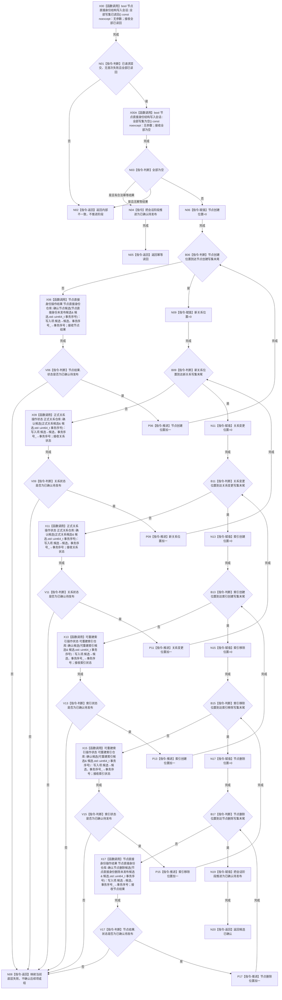

# CR-F14 会话完成确认单函数施工流程图

日期：2026-07-30
版本：v0.1
代码基线：`57866ac5ca63235ed12da60f635d29f1aacd718b`

## 依据与身份

依据：业务图 B11—B15；函数功能确认 CR-F14；逐节点分析 CR-F14；详细设计 §5、§7—§9。
本图是待实现目标函数的正式施工图。

## 函数合同

```text
根函数：完成确认
归属：海中鱼巣.核心.会话.节点直接身份结构写入 / 核心/会话.节点直接身份结构写入.ixx / 会话编排层私有成员
完整签名：节点直接身份结构写入结果 节点直接身份结构写入会话::完成确认()
参数：无。
返回：节点直接身份结构写入结果，值归执行器。
- 候选已确认：全部非空写集按固定顺序确认并把会话阶段推进为已确认待发布。
- 幂等读回：全部写集为空且存在合法幂等结果，阶段推进为已确认待发布。
- 内部不一致或底层映射结果：任一前置/候选确认失败时立即返回；不发布。
确认顺序：节点创建→新关系→关系变更→索引创建→索引移除→节点删除。
```

被调函数：
- CR-F35 `节点直接身份结构写入会话::全部写集已读回() const noexcept`。
- CR-F36 `节点直接身份结构写入会话::全部写集为空() const noexcept`。
- `节点直接身份仓库::确认节点候选`（节点创建）。
- `正式关系仓库::确认候选`（新关系、失效/重挂）。
- CR-F09 `可重建索引仓库::确认候选`，见 `流程图/20260730_CORE-RETIRE-P1_CR-F09_确认索引候选单函数施工流程图_v0.1.md`。
- `节点直接身份仓库::确认节点删除候选`（节点删除）。
调用者：`节点直接身份结构写入执行器::执行` 的确认阶段。失败后由 CR-F15 逆序撤销；成功后由 CR-F37 `完成发布()` 进入无失败区。

## 流程图



## 节点合同与边界

| 节点 | 事实读写 | 顺序/失败边界 | 验证 |
| --- | --- | --- | --- |
| X00—N05 | 具名调用 CR-F35/CR-F36 后只读会话决定、失败和读回标记 | 空写集只有合法幂等可确认 | T35、T45 |
| N06—N16 | 依次确认创建/关系/索引候选 | 任一失败立即返回，后组不确认 | T35—T42 |
| N17—N20 | 节点删除最后确认并推进会话阶段 | 删除确认不得先于引用退役确认 | T39—T45 |

确认不改变普通读取可见性，不清除撤销材料，也不发布任何候选。部分组已确认而后组失败时，执行器必须调用 CR-F15，从节点删除到节点创建逆序尝试全部撤销；不得就地继续发布。
