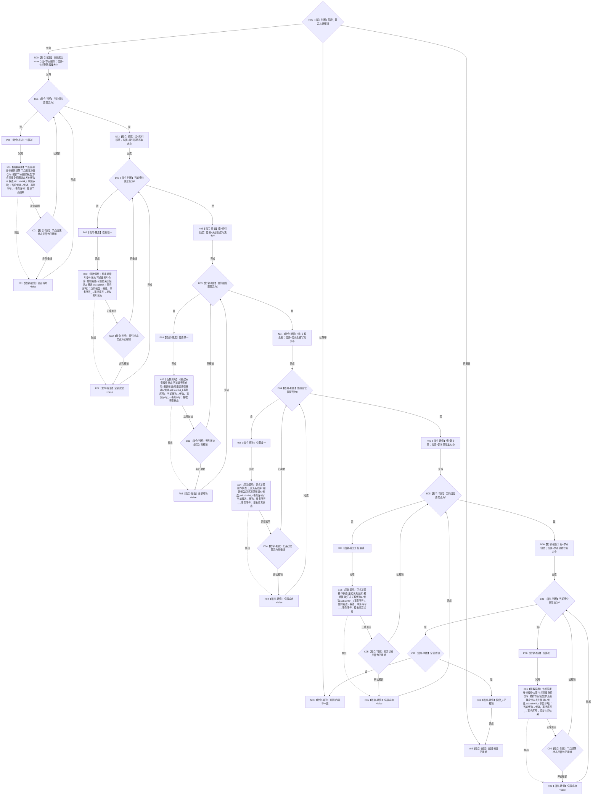

# CORE-RETIRE-P1 CR-F15 会话完成撤销单函数施工流程图

更新时间：2026-07-30
版本：v0.1
代码基线：`57866ac5ca63235ed12da60f635d29f1aacd718b`

## 依据

```text
流程图/20260730_CORE-RETIRE-P1_关系反向读取与节点退役事务业务流程图_v0.1.md（B11—B15）
规范/详细设计/20260730_CORE-RETIRE-P1_函数功能确认_v0.1.md（CR-F15）
规范/详细设计/20260730_CORE-RETIRE-P1_逐函数逐节点实现分析_v0.1.md（CR-F15 N01—N09）
规范/详细设计/20260730_CORE-RETIRE-P1_关系反向读取与核心节点退役事务详细设计_v0.1.md（§4.3、§5—§7）
```

## 身份与边界

本图是待实现目标函数的正式施工流程图，一图只对应 CR-F15。函数只负责在发布前按严格逆序尽力撤销会话全部核心写集；任一撤销失败仍继续其余撤销，最终返回内部不一致，由执行器隔离事务域。不得撤销已发布会话。

## 函数合同

```text
根函数：节点直接身份结构写入会话::完成撤销
归属模块 / 文件 / 层级：海中鱼巣.核心.节点直接身份结构写入会话 / 海中鱼巣/核心/会话.节点直接身份结构写入.ixx / 核心事务会话层
现有或待新增：现有私有成员扩展
完整签名：节点直接身份结构写入结果 节点直接身份结构写入会话::完成撤销() noexcept
参数：无显式参数；隐式 this 为当前执行器回调期内唯一拥有的会话，非空且生命周期不越过回调
返回结果：节点直接身份结构写入结果；已撤销或全部撤销成功返回 候选已撤销；已发布、底层拒绝/异常或前态不一致返回 内部不一致
所有权：函数不取得仓库、候选或锁所有权；会话继续唯一拥有六组写集；底层仓库函数内部持锁
非法值：阶段为 已发布；事务序号为零或写集候选不属于本事务；均不得产生假成功
异常：noexcept；逐项捕获底层异常并累计失败，不允许异常越界
```

## 双向引用

- 调用者：`节点直接身份结构写入执行器::执行(...)` 的失败清理路径。
- 被调图：CR-F10 `可重建索引仓库::撤销候选`、CR-F18 `正式关系仓库::撤销候选`；节点删除/创建撤销复用节点仓现行具名入口。
- 固定组顺序与 CR-F14 确认、CR-F37 发布严格反向：节点删除→索引移除→索引创建→关系变更→新关系→节点创建。
- CR-F10、CR-F18 图须反向列出本图为调用者；执行器图须列出本图为失败清理被调函数。

## 流程图



## 节点合同

| 节点 | 类型 | 输入 / 结果 | 事实读写 | 后继与验证 |
| --- | --- | --- | --- | --- |
| N01 | 本函数内指令 | `阶段_` | 只读阶段 | 已撤销幂等；已发布禁止回滚 |
| N02—N07 | 函数调用 | 每组候选、`事务序号_`；接收具名状态 | 底层恢复写前事实；会话写集不删除 | 固定逆序；单项失败不短路 |
| N08—N09 | 本函数内指令 | 累计结果 | 仅全成功写 `阶段_=已撤销` | 失败必须返回内部不一致 |

## 关键边界

```text
固定撤销顺序：节点删除→索引移除→索引创建→关系变更→新关系→节点创建。
不持有跨仓锁，不把仓库锁或事务许可暴露给调用者。
任何失败都不得把会话标为已撤销；执行器据此隔离事务域。
```
