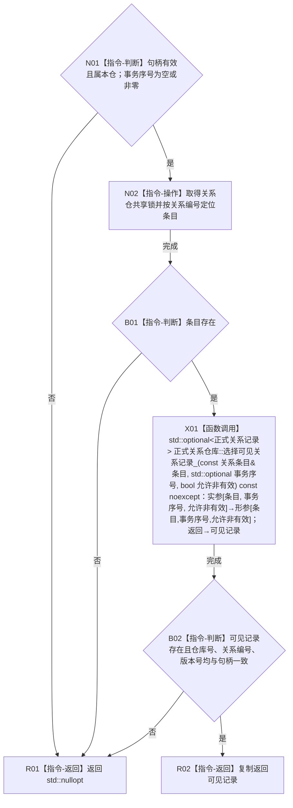

# CR-F16 读取关系核心单函数施工流程图

版本：v0.1
创建侧代码基线：`57866ac5ca63235ed12da60f635d29f1aacd718b`

## 函数合同

```text
根函数：正式关系仓库::读取关系核心_
归属：海中鱼巣.核心.仓库.正式关系 / 海中鱼巣/核心/仓库.正式关系.ixx
现有或待新增：现有类私有成员改造
完整签名：std::optional<正式关系记录> 正式关系仓库::读取关系核心_(关系句柄 关系, std::optional<std::uint64_t> 事务序号, bool 允许非有效) const
参数：关系按值；事务序号为空表示普通视图，有值必须非零；允许非有效仅供审计入口
返回：调用方独占的记录副本或 std::nullopt；无效句柄、错代、不可见或状态不符均为空
所有权：仓库拥有条目；函数只借用并持共享锁；锁与条目引用不逸出
结果语义：调用 CR-F23 从已发布基线或同事务候选写后中选择唯一可见版本，再以句柄版本和状态过滤
```



节点边界：CR-F23 只选择条目内版本；端点有效性由外层普通/事务读取在关系锁外复核。调用 [CR-F23](./20260730_CORE-RETIRE-P1_CR-F23_选择可见关系记录单函数施工流程图_v0.1.md)，并被普通/事务单关系读取及 CR-F25/CR-F26 调用。
