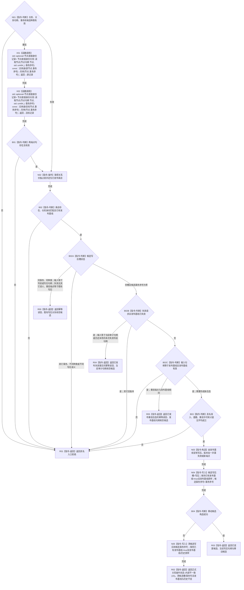

# CR-F17 形成已发布变更候选单函数施工流程图

版本：v0.1
创建侧代码基线：`57866ac5ca63235ed12da60f635d29f1aacd718b`

## 函数合同

```text
根函数：正式关系仓库::形成已发布变更候选_
归属：海中鱼巣.核心.仓库.正式关系 / 海中鱼巣/核心/仓库.正式关系.ixx
现有或待新增：现有类私有成员改造
完整签名：正式关系写入结果 正式关系仓库::形成已发布变更候选_(关系句柄 关系, 节点句柄 新源节点, 节点句柄 新目标节点, std::uint64_t 事务序号, 正式关系候选种类 种类)
参数：均值传入；事务非零；种类只允许失效或重挂；重挂端点须在同事务节点视图有效
返回：具名写入状态、当前关系和唯一移动候选；拒绝/内部不一致零候选、零发布事实变化；本函数不新增正式关系“资源失败”状态
所有权：已发布记录和独立候选槽归仓库；移动候选归会话；锁不逸出
结果语义：发布基线保持原位；写后只进入 optional 候选槽，并绑定该条目的候选事务序号；失效入口按4010同时接受本次失效写前句柄和其写后审计句柄的精确幂等重放
```



节点边界：候选形成期不得把写前推入历史或覆盖发布基线；候选槽检查先于发布基线版本拒绝，使同事务重复可以用本次写前或写后句柄回显同一写后。失效已经正式发布后，只有当前审计句柄或正式历史末项中与当前版本严格相邻、端点/类型/顺序号相同且状态有效的本次写前句柄可幂等读回；其它旧版本继续拒绝。父链检查调用 [CR-F29](./20260730_CORE-RETIRE-P1_CR-F29_子链包含节点已加锁单函数施工流程图_v0.1.md)。公开失效/重挂入口经 [CR-F58](./20260730_CORE-RETIRE-P1_CR-F58_登记关系候选单函数施工流程图_v0.1.md) 登记仓库结果。
