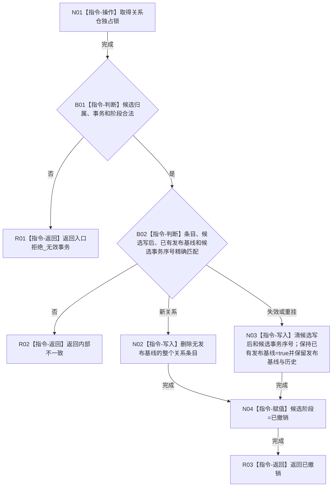

# CR-F18 撤销关系候选单函数施工流程图

版本：v0.1
创建侧代码基线：`57866ac5ca63235ed12da60f635d29f1aacd718b`

## 函数合同

```text
根函数：正式关系仓库::撤销候选
归属：海中鱼巣.核心.仓库.正式关系 / 海中鱼巣/核心/仓库.正式关系.ixx
现有或待新增：现有公开成员改造
完整签名：正式关系操作状态 正式关系仓库::撤销候选(正式关系候选& 候选, std::uint64_t 事务序号)
参数：候选为会话唯一拥有的可变借用；事务非零且须匹配；阶段只允许持有或已确认待发布
返回：已撤销、入口拒绝_无效事务或内部不一致；不得伪造半撤销成功
所有权：不取得候选；仓库独占锁仅在函数内
结果语义：新关系删除无发布基线条目；变更关系只清独立候选槽，发布基线和历史原样保留
```



节点边界：撤销变更候选不把候选写后写入历史，也不恢复或改写发布基线；调用方 CR-F15 反向引用本图。
