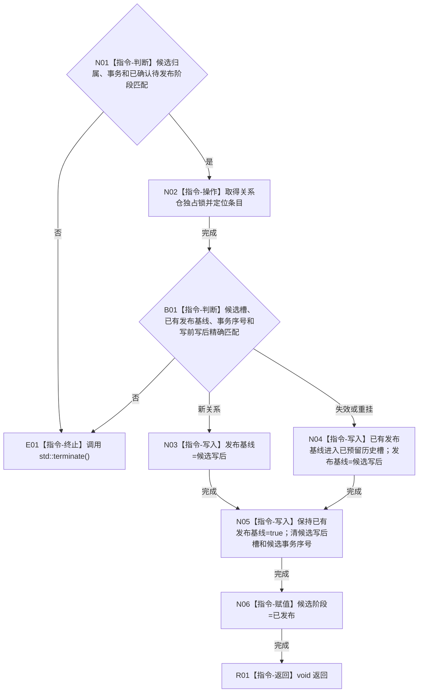

# CR-F19 完成发布关系候选单函数施工流程图

版本：v0.1
创建侧代码基线：`57866ac5ca63235ed12da60f635d29f1aacd718b`

## 函数合同

```text
根函数：正式关系仓库::完成发布
归属：海中鱼巣.核心.仓库.正式关系 / 海中鱼巣/核心/仓库.正式关系.ixx
现有或待新增：现有公开成员改造
完整签名：void 正式关系仓库::完成发布(正式关系候选& 候选, std::uint64_t 事务序号) noexcept
参数：候选为会话唯一拥有的可变借用且阶段必须为已确认待发布；事务非零并匹配
返回：void；成功关闭候选；任何前态不一致调用 std::terminate()
所有权：仓库拥有发布基线、历史和候选槽；确认阶段已预留历史容量；发布不分配
结果语义：新关系以候选写后建立首次发布基线；变更关系把既有发布基线入历史后以写后替换
```



节点边界：发布无失败、无分配、无外部调用；普通视图在 N03/N04 前后只发生一次原子版本切换。会话 `完成发布()` 反向引用本图。
