# CORE-RETIRE-P1 CR-F20 运行节点直接身份结构写入专项源码自检单函数施工流程图

更新时间：2026-07-30
版本：v0.1
代码基线：`57866ac5ca63235ed12da60f635d29f1aacd718b`

## 依据

```text
流程图/20260730_CORE-RETIRE-P1_关系反向读取与节点退役事务业务流程图_v0.1.md（B03—B17）
规范/详细设计/20260730_CORE-RETIRE-P1_函数功能确认_v0.1.md（CR-F20）
规范/详细设计/20260730_CORE-RETIRE-P1_逐函数逐节点实现分析_v0.1.md（CR-F20 N01—N24、R01—R06）
规范/详细设计/20260730_CORE-RETIRE-P1_关系反向读取与核心节点退役事务详细设计_v0.1.md（§8—§10）
当前定义证据：海中鱼巣/核心/自检.节点直接身份结构写入.ixx:663
```

## 身份与边界

本图是现有导出自检根函数的扩展施工流程图，一图只对应 CR-F20。不得新建第二自检根。函数保留现有27项结果，调用 CR-F45—CR-F50 取得固定47项新矩阵并拼接为74项报告；只形成自检报告，不写生产仓库、不成为生产机器事实。

## 函数合同

```text
根函数：运行节点直接身份结构写入自检
归属模块 / 文件 / 层级：海中鱼巣.核心.节点直接身份结构写入自检 / 海中鱼巣/核心/自检.节点直接身份结构写入.ixx / 专项源码自检层
现有或待新增：现有导出自由函数扩展（当前约第 663 行）
完整签名：节点直接身份结构写入自检报告 运行节点直接身份结构写入自检()
参数：无
返回结果：节点直接身份结构写入自检报告；把现有27项与新增47项固定为 `std::array<bool, 74> 验收`，并保留 `bool 总通过`、`std::size_t 失败数量`；调用方拥有值式报告
所有权：函数栈拥有隔离节点/关系/索引仓、执行器、夹具及报告；全部在返回前销毁；不得取得生产上下文
非法值：无入口参数；任何夹具前态不一致只把对应验收位置失败，不伪造成功
结果语义：现有27项和新增 T01—T47 全部为真时总通过；失败数量为74项中 false 的总数
```

## 双向引用

- 调用者：[CR-F51](20260730_CORE-RETIRE-P1_CR-F51_运行完整自检模式单函数施工流程图_v0.1.md)，由完整自检运行器以顺序170、稳定编号 `NODE-DIRECT-IDENTITY-P1` 登记。
- 被调目标：[CR-F45](20260730_CORE-RETIRE-P1_CR-F45_验证关系枚举矩阵单函数施工流程图_v0.1.md)、[CR-F46](20260730_CORE-RETIRE-P1_CR-F46_验证关系候选隔离矩阵单函数施工流程图_v0.1.md)、[CR-F47](20260730_CORE-RETIRE-P1_CR-F47_验证索引反向与移除矩阵单函数施工流程图_v0.1.md)、[CR-F48](20260730_CORE-RETIRE-P1_CR-F48_验证节点删除矩阵单函数施工流程图_v0.1.md)、[CR-F49](20260730_CORE-RETIRE-P1_CR-F49_验证确认撤销故障矩阵单函数施工流程图_v0.1.md)、[CR-F50](20260730_CORE-RETIRE-P1_CR-F50_验证统一可见点与日志边界单函数施工流程图_v0.1.md)。
- 现有27项继续调用原有内部自检函数；本图不替代任何生产调用图。

## 流程图

```mermaid
flowchart TD
    N01["N01【指令-构造】构造报告；调用现有内部自检并按原顺序形成27项 既有结果"]
    N01 -- "完成" --> N02["N02【函数调用】std::array<bool, 8> 验证关系枚举矩阵()：无实参→无形参；返回→关系枚举[8]"]
    N02 -- "完成" --> N03["N03【函数调用】std::array<bool, 5> 验证关系候选隔离矩阵()：无实参→无形参；返回→关系隔离[5]"]
    N03 -- "完成" --> N04["N04【函数调用】std::array<bool, 14> 验证索引反向与移除矩阵()：无实参→无形参；返回→索引矩阵[14]"]
    N04 -- "完成" --> N05["N05【函数调用】std::array<bool, 7> 验证节点删除矩阵()：无实参→无形参；返回→节点删除[7]"]
    N05 -- "完成" --> N06["N06【函数调用】std::array<bool, 11> 验证确认撤销故障矩阵()：无实参→无形参；返回→事务矩阵[11]"]
    N06 -- "完成" --> N07["N07【函数调用】std::array<bool, 2> 验证统一可见点与日志边界()：无实参→无形参；返回→边界矩阵[2]"]
    N07 -- "完成" --> N08["N08【指令-赋值】报告.验收[0..26]=既有结果原顺序"]
    N08 -- "完成" --> N09["N09【指令-赋值】报告.验收[27..34]=关系枚举[0..7]；[35..39]=关系隔离[0..4]"]
    N09 -- "完成" --> N10["N10【指令-赋值】报告.验收[40..53]=索引矩阵[0..13]；[54..60]=节点删除[0..6]"]
    N10 -- "完成" --> N11["N11【指令-赋值】报告.验收[61..71]=事务矩阵[0..10]；[72..73]=边界矩阵[0..1]"]
    N11 -- "完成" --> N12["N12【指令-计算】报告.失败数量=count(报告.验收中false)"]
    N12 -- "完成" --> N13["N13【指令-赋值】报告.总通过=(报告.失败数量==0)"]
    N13 -- "完成" --> N14["N14【指令-构造】构造固定 std::array<const wchar_t*,74> 宽字符串名称组"]
    N14 -- "完成" --> N15["N15【指令-宏调用】对当前结果执行 海中鱼巣记录节点直接身份结构自检调试日志(模块常量,入口常量,宽字符串结果)；宏关闭时内容参数零求值"]
    N15 -- "完成" --> N16["N16【指令-返回】返回值式 报告"]
```



## 节点合同

| 节点 | 类型 | 输入 / 输出 | 事实读写 | 验证 |
| --- | --- | --- | --- | --- |
| N01 | 本函数内指令 | 无→报告、27项既有结果 | 仅写函数栈隔离对象与报告 | 保持既有27项身份和顺序 |
| N02—N07 | 函数调用 | 无→六个固定长度数组 | 各被调根只写自己的隔离夹具 | 8+5+14+7+11+2=47 |
| N08—N11 | 本函数内指令 | 27项既有结果+47项新结果→验收[74] | 只写报告 | 槽位区间不可交换 |
| N12—N13 | 本函数内指令 | 74项验收→失败数量、总通过 | 只写报告 | 只计算一次 |
| N14 | 本函数内指令 | 固定74项宽字符串名称 | 宽字符串名称组 | 不改变机器结果 |
| N15 | 函数调用 | 模块、入口、宽字符串内容 | 关闭时零求值；开启时人读日志 | 不改变报告 |
| N16 | 本函数内指令 | 报告 | 值式返回 | 无条件 |

## 关键边界

```text
只扩展现有 `运行节点直接身份结构写入自检()`，不得新建第二自检根。
现有27项保持原顺序；六个矩阵按8/5/14/7/11/2固定长度拼接，后47项依次对应T01—T47。
报告只保留 `验收[74]`、`总通过`、`失败数量`；不得新增首个失败字段。
删除现有 `std::cout` 输出；名称数组改为74项宽字符串，逐项输出只走具名专项日志宏。
每个矩阵使用隔离仓与执行器；报告、日志或控制台文本都不是生产机器事实。
旧结构写入栈自检不得计入本包 T01—T47 的通过证明。
```
