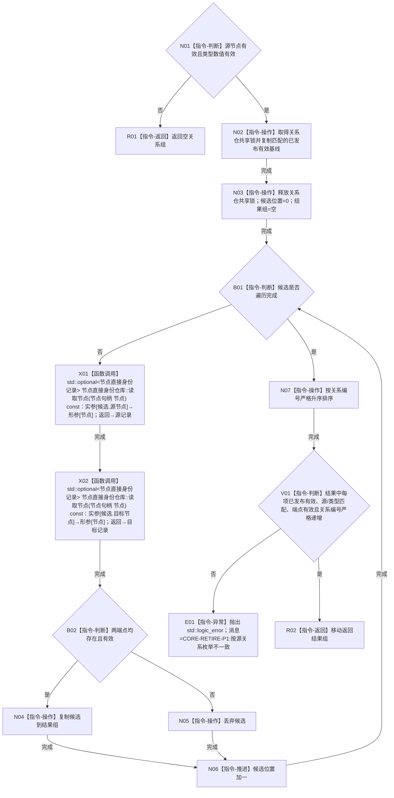

# CR-F21 读取有效关系组单函数施工流程图

版本：v0.1
创建侧代码基线：`57866ac5ca63235ed12da60f635d29f1aacd718b`

## 函数合同

```text
根函数：正式关系仓库::读取有效关系组
归属：海中鱼巣.核心.仓库.正式关系 / 海中鱼巣/核心/仓库.正式关系.ixx
现有或待新增：现有公开成员修订
完整签名：std::vector<正式关系记录> 正式关系仓库::读取有效关系组(节点句柄 源节点, 关系类型 类型) const
参数：源节点、类型值传入；无效句柄或未知类型返回空组
返回：调用方独占值式 vector；空组合法；按关系编号严格升序
所有权：只借用仓库和节点仓；锁与内部引用不逸出
结果语义：只复制已发布基线中状态有效、源和类型匹配的记录；候选写后不进入普通视图
异常：复制/排序的 std::bad_alloc/std::length_error 原样传播；后置不变量破坏抛固定前缀 CORE-RETIRE-P1: 的 std::logic_error；事务外由 CR-F56 清空整批并映射为内部不一致，事务内由写执行器撤销收口
```



节点边界：端点读取必须发生在释放关系仓锁后；不得返回半结果。[CR-F22](./20260730_CORE-RETIRE-P1_CR-F22_会话读取有效关系组单函数施工流程图_v0.1.md) 以本函数结果为事务叠加基线。
