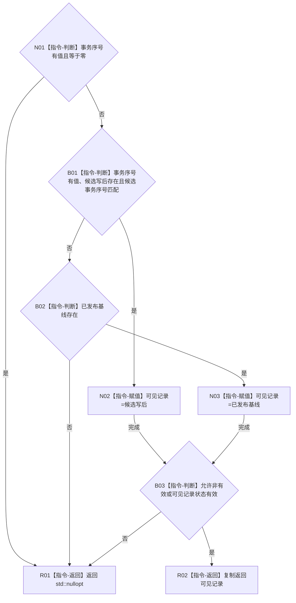

# CR-F23 选择可见关系记录单函数施工流程图

版本：v0.1
创建侧代码基线：`57866ac5ca63235ed12da60f635d29f1aacd718b`

## 函数合同

```text
根函数：正式关系仓库::选择可见关系记录_
归属：海中鱼巣.核心.仓库.正式关系 / 海中鱼巣/核心/仓库.正式关系.ixx
现有或待新增：待新增类私有成员
完整签名：std::optional<正式关系记录> 正式关系仓库::选择可见关系记录_(const 关系条目& 条目, std::optional<std::uint64_t> 事务序号, bool 允许非有效) const noexcept
参数：条目为调用期只读借用且调用方已持关系仓锁；事务序号为空表示普通视图，有值必须非零；允许非有效控制状态过滤
返回：所选记录副本或 std::nullopt；无分配、无抛出
所有权：仓库拥有条目；调用方拥有返回副本；本函数不加锁、不外泄条目引用
结果语义：同事务候选写后优先；否则只选已发布基线；其它事务候选不可见
```



节点边界：本函数不复核端点、不解释句柄版本、不改变候选读回状态。直接调用方为 [CR-F16](./20260730_CORE-RETIRE-P1_CR-F16_读取关系核心单函数施工流程图_v0.1.md) 和 [CR-F29](./20260730_CORE-RETIRE-P1_CR-F29_子链包含节点已加锁单函数施工流程图_v0.1.md)。
