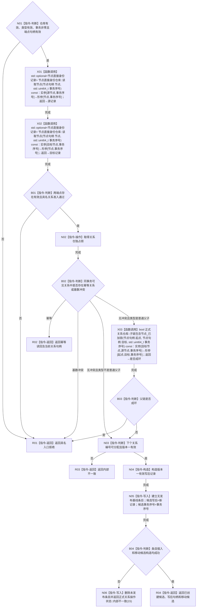

# CR-F24 结构化创建关系未发布候选单函数施工流程图

版本：v0.1
创建侧代码基线：`57866ac5ca63235ed12da60f635d29f1aacd718b`

## 函数合同

```text
根函数：正式关系仓库::结构化创建关系未发布候选
归属：海中鱼巣.核心.仓库.正式关系 / 海中鱼巣/核心/仓库.正式关系.ixx
现有或待新增：现有公开成员改造
完整签名：正式关系写入结果 正式关系仓库::结构化创建关系未发布候选(关系类型 类型, 节点句柄 源节点, 节点句柄 目标节点, std::int64_t 顺序号, std::uint64_t 事务序号)
参数：全部值传入；事务非零；类型须在 ABI；端点须在同事务节点视图存在且有效
返回：具名状态、当前关系句柄及成功时唯一移动候选；拒绝/失败无可读半候选
所有权：新条目及候选槽归仓库；移动候选归会话；锁不逸出
结果语义：新条目无发布基线，仅设置 optional 候选写后和候选事务序号；普通读取不可见
```



节点边界：端点读取发生在关系锁外；父链检查使用 [CR-F29](./20260730_CORE-RETIRE-P1_CR-F29_子链包含节点已加锁单函数施工流程图_v0.1.md)。确认、撤销、发布分别由 CR-F28、CR-F18、CR-F19 完成。
