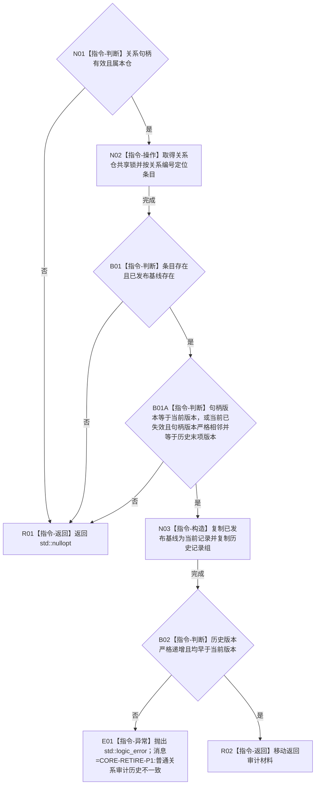

# CR-F25 普通读取关系审计单函数施工流程图

版本：v0.1
创建侧代码基线：`57866ac5ca63235ed12da60f635d29f1aacd718b`

## 函数合同

```text
根函数：正式关系仓库::读取关系审计
归属：海中鱼巣.核心.仓库.正式关系 / 海中鱼巣/核心/仓库.正式关系.ixx
现有或待新增：现有普通公开重载改造
完整签名：std::optional<正式关系审计材料> 正式关系仓库::读取关系审计(关系句柄 关系) const
参数：关系句柄值传入；须属于本仓；通常匹配已发布基线版本；若当前已发布基线状态为已失效，也接受严格相邻且等于历史末项的本次写前句柄
返回：调用方独占审计材料副本或 std::nullopt；候选槽不进入普通审计
所有权：仓库拥有条目和历史；锁内复制，锁不逸出
结果语义：当前记录为已发布基线；历史组只含既往已发布版本并保持版本升序
异常：复制分配的 `std::bad_alloc/std::length_error` 原样传播；历史不变量破坏抛固定前缀 `CORE-RETIRE-P1:` 的 `std::logic_error`；不得返回半审计材料
```



节点边界：候选写后、已有发布基线候选副本和候选事务序号均不可见；事务审计见 [CR-F26](./20260730_CORE-RETIRE-P1_CR-F26_事务读取关系审计单函数施工流程图_v0.1.md)。
