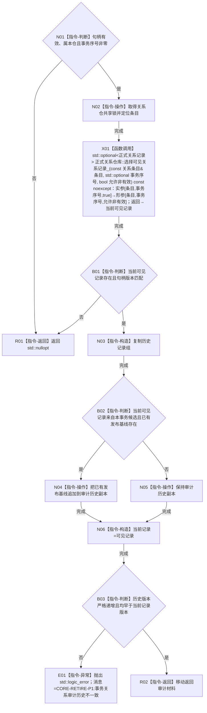

# CR-F26 事务读取关系审计单函数施工流程图

版本：v0.1
创建侧代码基线：`57866ac5ca63235ed12da60f635d29f1aacd718b`

## 函数合同

```text
根函数：正式关系仓库::读取关系审计
归属：海中鱼巣.核心.仓库.正式关系 / 海中鱼巣/核心/仓库.正式关系.ixx
现有或待新增：现有事务公开重载改造
完整签名：std::optional<正式关系审计材料> 正式关系仓库::读取关系审计(关系句柄 关系, std::uint64_t 事务序号) const
参数：关系句柄、事务序号值传入；事务必须非零；句柄须匹配本事务可见版本
返回：调用方独占审计材料副本或 std::nullopt
所有权：锁内复制仓库材料；不外泄条目、锁或候选
结果语义：同事务候选存在时当前记录为写后；其已有发布基线接在既往历史之后；其它事务候选不可见
异常：复制/追加分配的 `std::bad_alloc/std::length_error` 原样传播；历史不变量破坏抛固定前缀 `CORE-RETIRE-P1:` 的 `std::logic_error`；写执行器捕获后撤销
```



节点边界：调用 [CR-F23](./20260730_CORE-RETIRE-P1_CR-F23_选择可见关系记录单函数施工流程图_v0.1.md)。本函数的精确候选读取由会话入口和 [CR-F57](./20260730_CORE-RETIRE-P1_CR-F57_登记核心节点退役候选单函数施工流程图_v0.1.md) 使用并标记对应候选已读回；枚举入口不得替代该读回。
