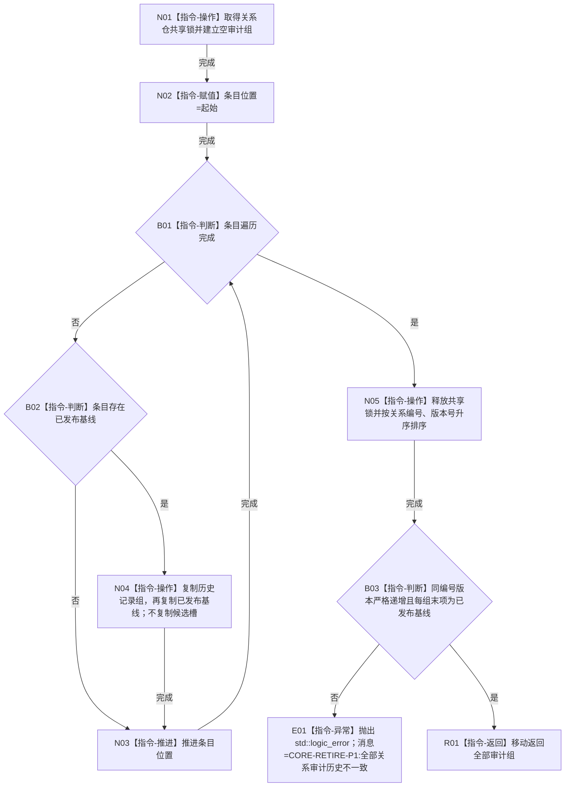

# CR-F27 读取全部关系审计单函数施工流程图

版本：v0.1
创建侧代码基线：`57866ac5ca63235ed12da60f635d29f1aacd718b`

## 函数合同

```text
根函数：正式关系仓库::读取全部关系审计
归属：海中鱼巣.核心.仓库.正式关系 / 海中鱼巣/核心/仓库.正式关系.ixx
现有或待新增：现有公开成员改造
完整签名：std::vector<正式关系记录> 正式关系仓库::读取全部关系审计() const
参数：无
返回：调用方独占的全部已发布历史与当前记录副本；空仓返回含零项 vector
所有权：共享锁内复制；仓库条目、候选和锁不逸出
结果语义：完全排除未发布候选；按关系编号升序、同编号按版本号升序
异常：复制/排序分配的 `std::bad_alloc/std::length_error` 原样传播；全量历史不变量破坏抛固定前缀 `CORE-RETIRE-P1:` 的 `std::logic_error`；不得返回半结果
```



节点边界：该函数是冻结/审计的普通已发布视图，不接收事务序号，也不展示任何隔离候选。
