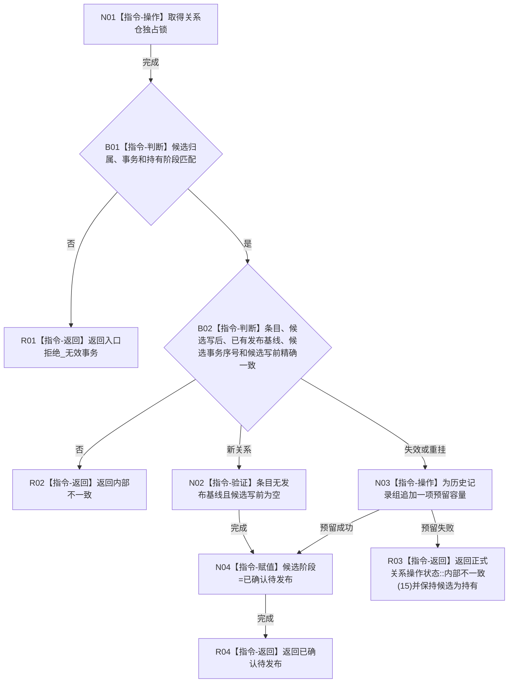

# CR-F28 确认关系候选单函数施工流程图

版本：v0.1
创建侧代码基线：`57866ac5ca63235ed12da60f635d29f1aacd718b`

## 函数合同

```text
根函数：正式关系仓库::确认候选
归属：海中鱼巣.核心.仓库.正式关系 / 海中鱼巣/核心/仓库.正式关系.ixx
现有或待新增：现有公开成员改造
完整签名：正式关系操作状态 正式关系仓库::确认候选(正式关系候选& 候选, std::uint64_t 事务序号)
参数：候选为会话唯一拥有的可变借用且阶段为持有；事务非零并匹配
返回：已确认待发布、入口拒绝_无效事务或内部不一致；历史容量预留失败使用既有 `内部不一致=15`
所有权：不取得候选；独占锁仅在函数内；成功只推进候选阶段
结果语义：核对独立候选槽；变更候选在确认期为历史追加预留容量，仍不改变普通可见基线
```



节点边界：确认不发布、不写历史、不替换基线；CR-F19 的无失败发布依赖本函数预留完成。会话 CR-F14 反向引用本图。
