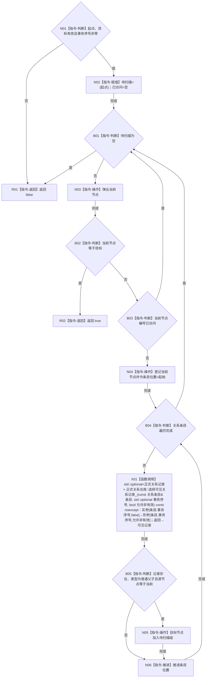

# CR-F29 子链包含节点已加锁单函数施工流程图

版本：v0.1
创建侧代码基线：`57866ac5ca63235ed12da60f635d29f1aacd718b`

## 函数合同

```text
根函数：正式关系仓库::子链包含节点_已加锁
归属：海中鱼巣.核心.仓库.正式关系 / 海中鱼巣/核心/仓库.正式关系.ixx
现有或待新增：现有类私有成员改造
完整签名：bool 正式关系仓库::子链包含节点_已加锁(节点句柄 起点, 节点句柄 目标, std::uint64_t 事务序号) const
参数：起点、目标、事务序号值传入；调用方已持关系仓锁；事务须非零
返回：存在本事务可见的普通父子有效路径时 true，否则 false
所有权：局部待扫描组和已访问组归函数；不取得节点或条目所有权
结果语义：逐条调用 CR-F23 选择同事务写后或发布基线；其它事务候选不可见；环通过已访问集合有限收口
```



节点边界：函数不取得第二把锁，不读取节点仓，不抛出候选可见性；调用 [CR-F23](./20260730_CORE-RETIRE-P1_CR-F23_选择可见关系记录单函数施工流程图_v0.1.md)，被 CR-F17 和 CR-F24 调用。
