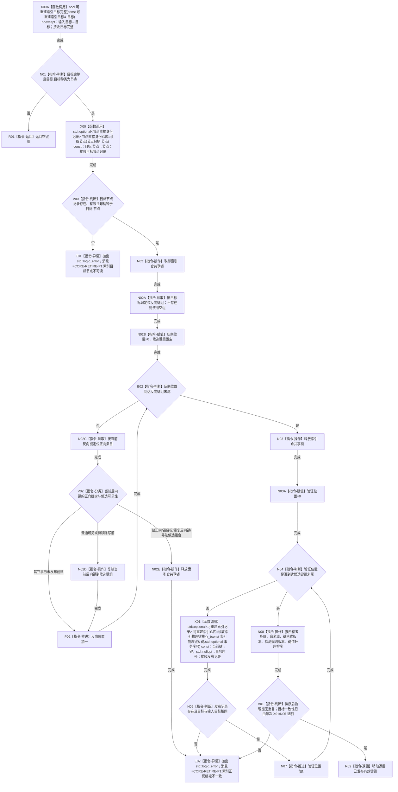

# CR-F30 读取目标索引物理键组单函数施工流程图

日期：2026-07-30
版本：v0.1
创建侧代码基线：`57866ac5ca63235ed12da60f635d29f1aacd718b`

## 函数合同

```text
根函数：可重建索引仓库::读取目标索引物理键组
归属模块 / 文件 / 层级：海中鱼巣.核心.仓库.可重建索引 / 海中鱼巣/核心/仓库.可重建索引.ixx / 仓库公开只读层
完整签名：std::vector<索引物理键> 可重建索引仓库::读取目标索引物理键组(const 可重建索引目标& 目标) const
参数：目标，const 引用，只在调用期借用；只含目标种类、节点句柄、关系句柄；必须完整且本包仅接受节点目标，不需要伪造索引物理键
返回：调用方独占的已发布有效物理键副本组；空组合法；五字段严格升序
非法值与异常：`可重建索引目标完整(目标)==false` 或非节点目标返回空组；目标节点普通读取无效、反向键缺正向记录、正反目标错配或重复键属于结构不一致，抛固定前缀 CORE-RETIRE-P1: 的 std::logic_error；复制/排序的 std::bad_alloc/std::length_error 原样传播，不返回半结果
```

调用者：CR-F07。被调图：CR-F31 普通分支。



关键边界：无事务重载；普通反向读取只见发布基线和待移除写前，不见其它事务未发布创建。排除未发布创建是合法可见性裁决，不能用过滤或去重掩盖悬空键、错目标、重复反向绑定或非法候选组合。目标节点读取与逐键 CR-F31 调用均发生在索引仓共享锁之外；CR-F31 反向列出本图为调用者。
