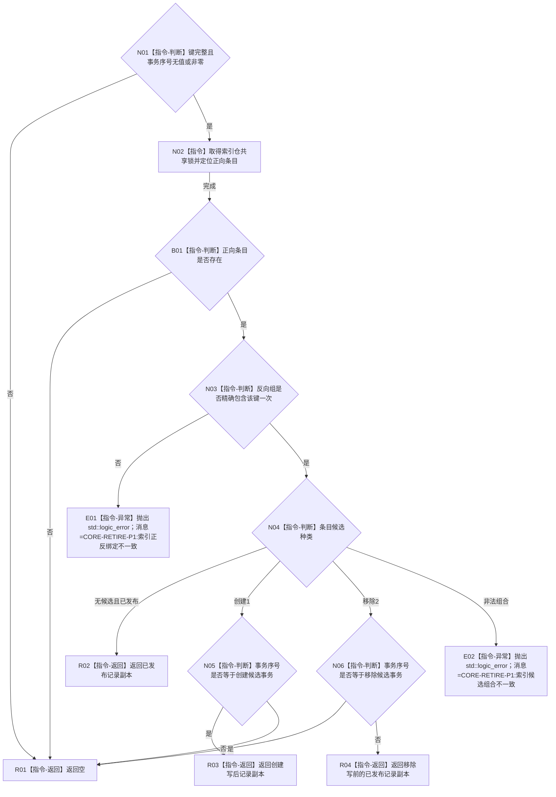

# CR-F31 读取索引物理键核心单函数施工流程图

日期：2026-07-30
版本：v0.1
创建侧代码基线：`57866ac5ca63235ed12da60f635d29f1aacd718b`

## 函数合同

```text
根函数：可重建索引仓库::读取索引物理键核心_
归属模块 / 文件 / 层级：海中鱼巣.核心.仓库.可重建索引 / 海中鱼巣/核心/仓库.可重建索引.ixx / 仓库私有只读层
完整签名：std::optional<可重建索引记录> 可重建索引仓库::读取索引物理键核心_(const 索引物理键& 键, std::optional<std::uint64_t> 事务序号) const
参数：键为调用期借用的完整五字段键；事务序号无值表示普通读取，有值时必须非零
返回：值式记录副本或空；普通读取见发布基线，本事务读取见自身创建写后且隐藏自身移除写前
非法值与异常：键不完整或事务值为0返回空；正向条目存在但反向绑定缺失/重复、候选组合非法时抛固定前缀 CORE-RETIRE-P1: 的 std::logic_error；其它事务未发布创建返回空
```

调用者：CR-F30、索引仓公开普通/事务键读取。无复杂被调函数。



关键边界：只在本仓内部持锁；不调用节点仓、关系仓或日志。目标权威复核由公开包装函数在锁外完成。物理键不存在是合法未命中；正向存在而反向错配不是未命中。
