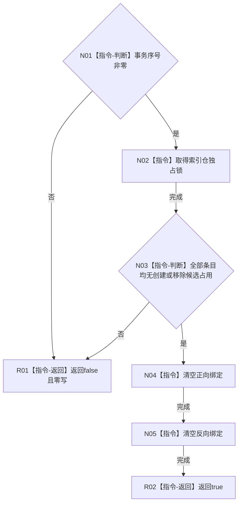

# CR-F32 清空可重建索引单函数施工流程图

日期：2026-07-30
版本：v0.1
创建侧代码基线：`57866ac5ca63235ed12da60f635d29f1aacd718b`

## 函数合同

```text
根函数：可重建索引仓库::清空可重建索引
归属模块 / 文件 / 层级：海中鱼巣.核心.仓库.可重建索引 / 海中鱼巣/核心/仓库.可重建索引.ixx / 仓库维护层
完整签名：bool 可重建索引仓库::清空可重建索引(std::uint64_t 事务序号)
参数：事务序号，值传入，必须非零
返回：true 表示正向与反向材料均已清空；false 表示入口拒绝且零写
非法值：事务序号0；任一创建(1)或移除(2)候选占用
```

调用者：恢复/维护编排。无复杂被调函数。



关键边界：候选占用拒绝必须在任何清空前完成；不得只检查“未发布创建”而漏掉已发布记录上的移除候选。
