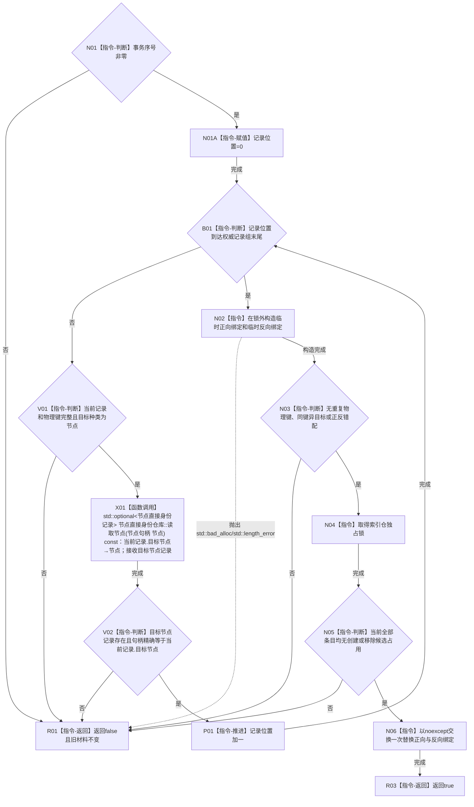

# CR-F33 从权威记录重建单函数施工流程图

日期：2026-07-30
版本：v0.1
创建侧代码基线：`57866ac5ca63235ed12da60f635d29f1aacd718b`

## 函数合同

```text
根函数：可重建索引仓库::从权威记录重建
归属模块 / 文件 / 层级：海中鱼巣.核心.仓库.可重建索引 / 海中鱼巣/核心/仓库.可重建索引.ixx / 仓库维护层
完整签名：bool 可重建索引仓库::从权威记录重建(const std::vector<可重建索引记录>& 记录组, std::uint64_t 事务序号)
参数：记录组在调用期只借用；事务序号值传入且非零
返回：true 表示完整新正反材料一次交换发布；false 表示拒绝且旧材料不变
非法值：记录不完整、非节点目标、目标权威不可读、重复物理键、资源失败、任一创建/移除候选占用
```

调用者：恢复/维护编排。被调图：CR-F31 的公开包装路径用于发布后读回。



关键边界：临时材料在交换前已经完成正反一一对应证明，交换后不存在可恢复的失败分支；锁内只复核占用并交换。任何创建或移除候选都拒绝零写。输入不产生隐式“读取最新”或默认目标。
