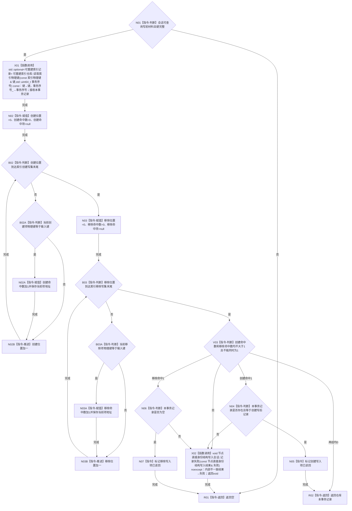

# CR-F34 会话读取索引物理键单函数施工流程图

日期：2026-07-30
版本：v0.1
创建侧代码基线：`57866ac5ca63235ed12da60f635d29f1aacd718b`

## 函数合同

```text
根函数：节点直接身份结构写入会话::读取索引物理键
归属模块 / 文件 / 层级：海中鱼巣.核心.会话.节点直接身份结构写入 / 海中鱼巣/核心/会话.节点直接身份结构写入.ixx / 会话公开只读层
完整签名：std::optional<可重建索引记录> 节点直接身份结构写入会话::读取索引物理键(const 索引物理键& 键)
参数：键，const 引用，只在调用期借用；必须为完整五字段键
返回：本事务可见记录副本或空；创建候选命中，移除候选不命中
非法值：会话不可查询或键不完整返回空；创建/移除同键并存记录内部不一致
```

调用者：CR-F07、CR-F13、[CR-F57](./20260730_CORE-RETIRE-P1_CR-F57_登记核心节点退役候选单函数施工流程图_v0.1.md)。被调图：索引仓公开事务键读取经 CR-F31 核心读取。



关键边界：移除读回的成功证据就是空记录，不能因空值跳过标记；普通读取仍保留发布基线。
