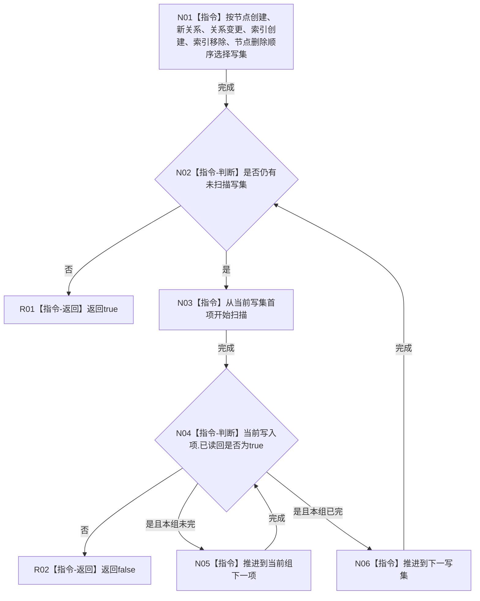

# CR-F35 全部写集已读回单函数施工流程图

日期：2026-07-30
版本：v0.1
创建侧代码基线：`57866ac5ca63235ed12da60f635d29f1aacd718b`

## 函数合同

```text
根函数：节点直接身份结构写入会话::全部写集已读回
归属模块 / 文件 / 层级：海中鱼巣.核心.会话.节点直接身份结构写入 / 海中鱼巣/核心/会话.节点直接身份结构写入.ixx / 会话私有门禁
完整签名：bool 节点直接身份结构写入会话::全部写集已读回() const noexcept
参数：无；隐式this为当前会话，只读借用
返回：六组写集每项已读回才为true，否则false
非法值：无；不得修改阶段、写集或失败状态
```

调用者：`请求提交()`、CR-F14。无被调函数。



关键边界：索引移除和节点删除是独立写集，必须显式纳入；空组不影响结果。
