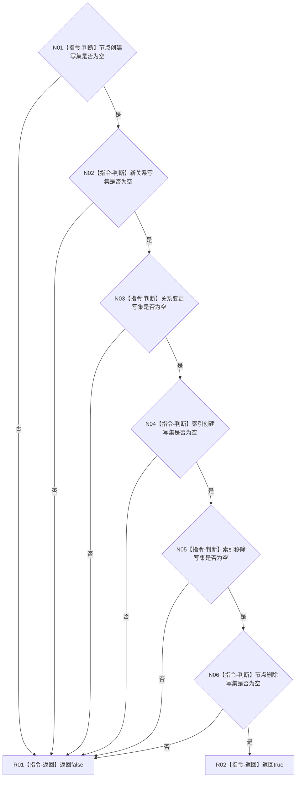

# CR-F36 全部写集为空单函数施工流程图

日期：2026-07-30
版本：v0.1
创建侧代码基线：`57866ac5ca63235ed12da60f635d29f1aacd718b`

## 函数合同

```text
根函数：节点直接身份结构写入会话::全部写集为空
归属模块 / 文件 / 层级：海中鱼巣.核心.会话.节点直接身份结构写入 / 海中鱼巣/核心/会话.节点直接身份结构写入.ixx / 会话私有门禁
完整签名：bool 节点直接身份结构写入会话::全部写集为空() const noexcept
参数：无；隐式this为当前会话，只读借用
返回：六组写集均为空才为true，否则false
非法值：无；不得把幂等结果视为写集
```

调用者：`请求提交()`、`请求仅参与者提交()`、`完成仅参与者确认()`、CR-F14。无被调函数。



关键边界：不得漏掉新增的索引移除和节点删除写集；合法幂等结果由调用者单独裁决。
