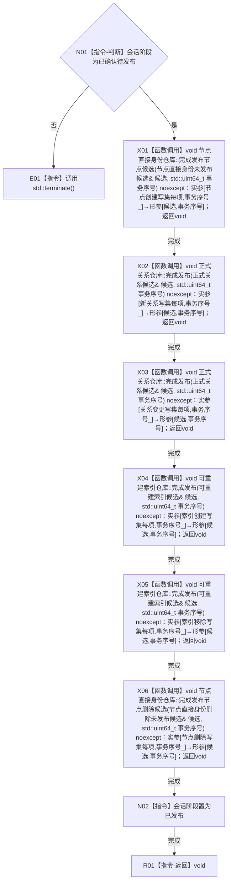

# CR-F37 会话完成发布单函数施工流程图

日期：2026-07-30
版本：v0.1
创建侧代码基线：`57866ac5ca63235ed12da60f635d29f1aacd718b`

## 函数合同

```text
根函数：节点直接身份结构写入会话::完成发布
归属模块 / 文件 / 层级：海中鱼巣.核心.会话.节点直接身份结构写入 / 海中鱼巣/核心/会话.节点直接身份结构写入.ixx / 会话私有无失败发布层
完整签名：void 节点直接身份结构写入会话::完成发布() noexcept
参数：无；隐式this为已确认待发布且由执行器唯一拥有的会话
返回：void；成功把六组写集按固定顺序发布并把会话阶段置已发布
非法值：阶段不匹配或任一底层发布前态错配必须std::terminate，不得返回半发布会话
```

调用者：节点直接身份结构写入执行器无失败发布阶段。被调图：CR-F11 索引候选发布；节点/关系发布复用现有入口。



关键边界：发布顺序严格为节点创建→新关系→关系变更→索引创建→索引移除→节点删除，与 CR-F14 确认相同、与 CR-F15 撤销相反；无失败区不得分配、记录日志或调用外部回调。
