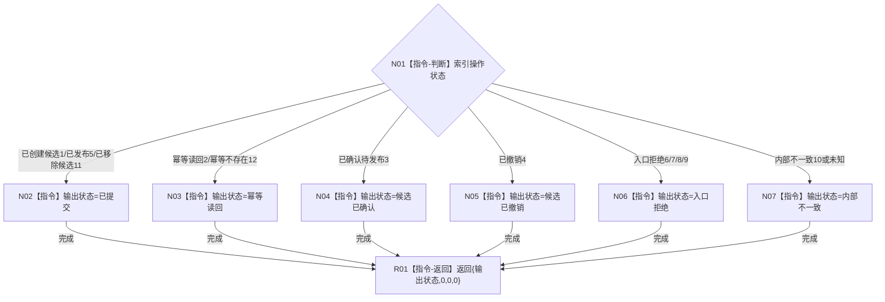

# CR-F38 转换索引结果单函数施工流程图

日期：2026-07-30
版本：v0.1
创建侧代码基线：`57866ac5ca63235ed12da60f635d29f1aacd718b`

## 函数合同

```text
根函数：节点直接身份结构写入会话::转换索引结果
归属模块 / 文件 / 层级：海中鱼巣.核心.会话.节点直接身份结构写入 / 海中鱼巣/核心/会话.节点直接身份结构写入.ixx / 会话私有纯转换
完整签名：static 节点直接身份结构写入结果 节点直接身份结构写入会话::转换索引结果(可重建索引操作状态 状态) noexcept
参数：状态，值传入；允许现行1—10及新增11—12
返回：值式节点直接身份结构写入结果；编号/写前版本/写后版本均为0
非法值：未知枚举值映射内部不一致，不抛异常
```

调用者：创建索引候选、CR-F13、CR-F14。无被调函数。



关键边界：新增 `已移除候选(11)` 不是发布完成但属于已提交候选；`幂等不存在(12)` 必须映射幂等读回，不得伪造默认索引记录。
