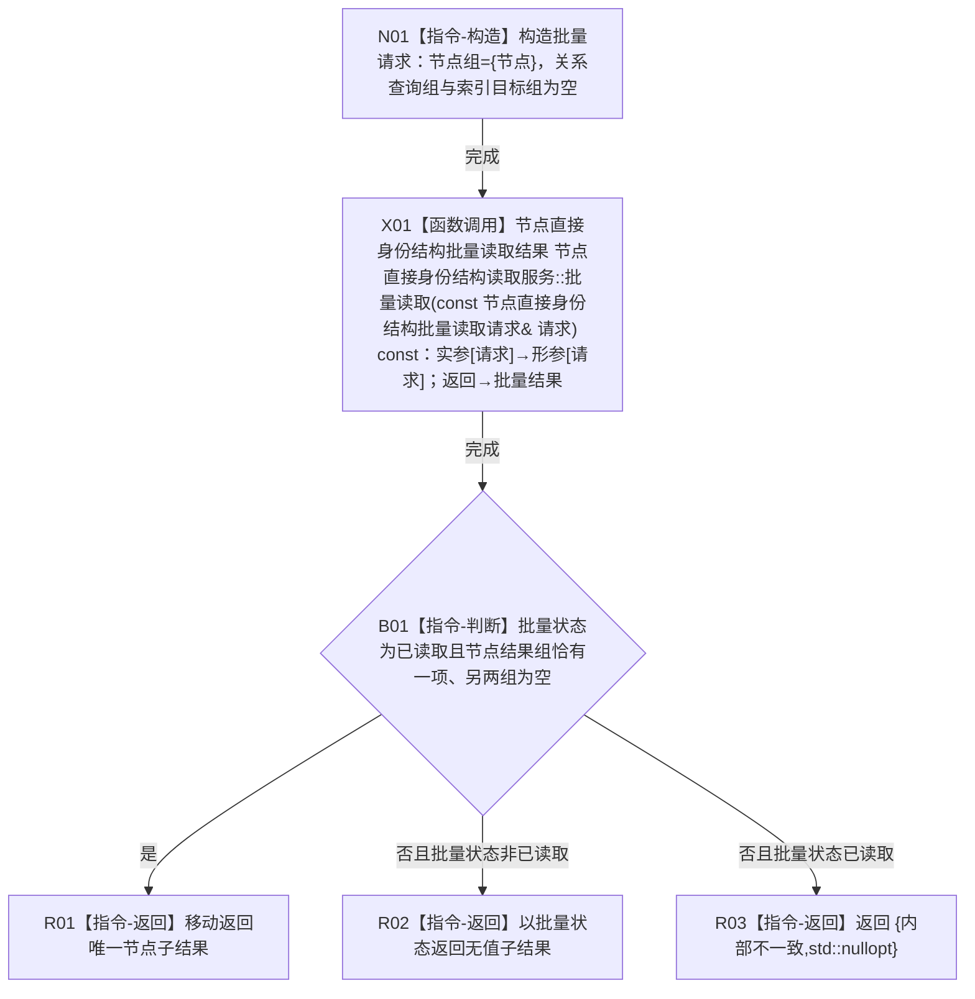

# CR-F39 读取服务读取节点单函数施工流程图

版本：v0.1
创建侧代码基线：`57866ac5ca63235ed12da60f635d29f1aacd718b`

## 函数合同

```text
根函数：节点直接身份结构读取服务::读取节点
归属：海中鱼巣.核心.执行器.节点直接身份结构写入 / 海中鱼巣/核心/执行器.节点直接身份结构写入.ixx
现有或待新增：待新增公开成员
完整签名：节点直接身份结构读取结果<节点直接身份记录> 节点直接身份结构读取服务::读取节点(节点句柄 节点) const
参数：节点句柄值传入；合法性统一由 CR-F56 批量入口裁决
返回：唯一节点子结果；已读取含记录、未命中无值，其它状态无值
所有权：请求与返回副本归本函数/调用方；本函数不取得许可、不直接访问仓库
```



双向引用：唯一非平凡被调函数为 [CR-F56](./20260730_CORE-RETIRE-P1_CR-F56_读取服务批量读取单函数施工流程图_v0.1.md)；CR-F56 的单节点包装调用者反向引用本图。
