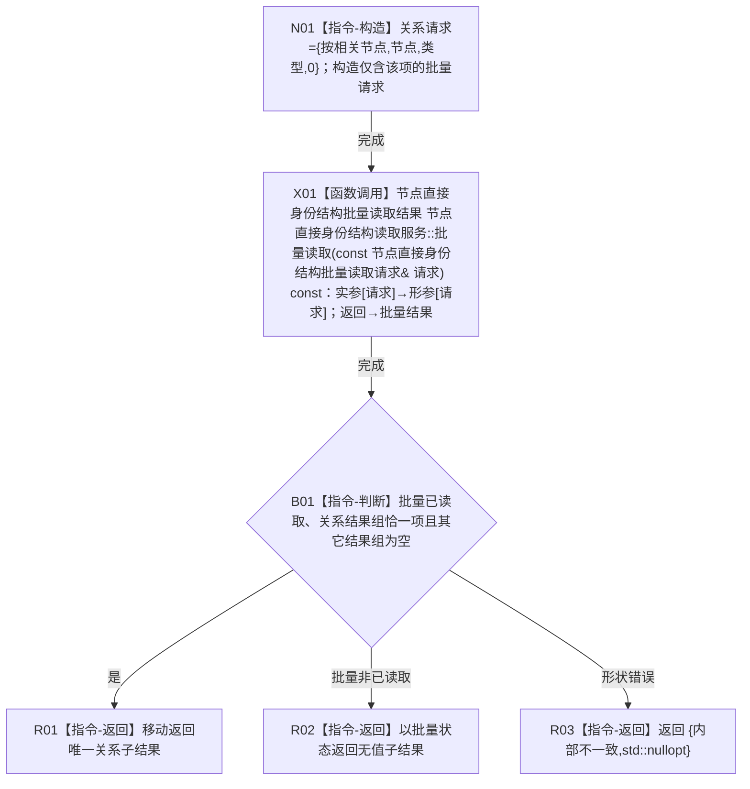

# CR-F42 读取服务读取相关有效关系组单函数施工流程图

版本：v0.1
创建侧代码基线：`57866ac5ca63235ed12da60f635d29f1aacd718b`

## 函数合同

```text
根函数：节点直接身份结构读取服务::读取相关有效关系组
归属：海中鱼巣.核心.执行器.节点直接身份结构写入 / 海中鱼巣/核心/执行器.节点直接身份结构写入.ixx
现有或待新增：待新增公开成员
完整签名：节点直接身份结构读取结果<std::vector<正式关系记录>> 节点直接身份结构读取服务::读取相关有效关系组(节点句柄 节点, 关系类型 类型) const
参数：节点、类型值传入；CR-F56 统一校验
返回：唯一关系子结果；合法空组为 已读取+含空 vector
所有权：不取得许可、不直接访问仓库；返回 vector 归调用方
```



双向引用：[CR-F56](./20260730_CORE-RETIRE-P1_CR-F56_读取服务批量读取单函数施工流程图_v0.1.md) 在许可内调用 CR-F02；本函数不得直接调用 CR-F02。
