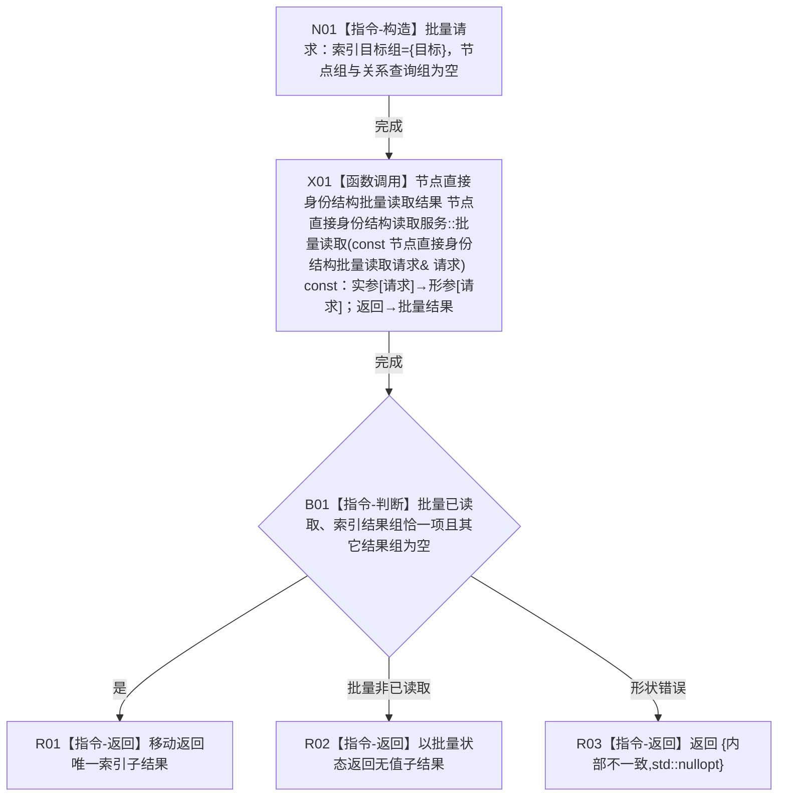

# CR-F44 读取服务读取目标索引物理键组单函数施工流程图

版本：v0.1
创建侧代码基线：`57866ac5ca63235ed12da60f635d29f1aacd718b`

## 函数合同

```text
根函数：节点直接身份结构读取服务::读取目标索引物理键组
归属：海中鱼巣.核心.执行器.节点直接身份结构写入 / 海中鱼巣/核心/执行器.节点直接身份结构写入.ixx
现有或待新增：待新增公开成员
完整签名：节点直接身份结构读取结果<std::vector<索引物理键>> 节点直接身份结构读取服务::读取目标索引物理键组(const 可重建索引目标& 目标) const
参数：目标为调用期只读借用；须为完整节点目标，CR-F56 统一校验
返回：唯一索引子结果；合法空组为 已读取+含空 vector
所有权：请求复制目标；返回键组归调用方；本函数不取得许可、不访问仓库
```



双向引用：[CR-F56](./20260730_CORE-RETIRE-P1_CR-F56_读取服务批量读取单函数施工流程图_v0.1.md) 在许可内调用 CR-F30；本函数不得直接调用索引仓。
