# CORE-RETIRE-P1 CR-F45 验证关系枚举矩阵单函数施工流程图

更新时间：2026-07-30
版本：v0.1
代码基线：`57866ac5ca63235ed12da60f635d29f1aacd718b`

## 依据

```text
规范/详细设计/20260730_CORE-RETIRE-P1_函数功能确认_v0.1.md（CR-F01—F06、CR-F21—F22、CR-F45）
规范/详细设计/20260730_CORE-RETIRE-P1_关系反向读取与核心节点退役事务详细设计_v0.1.md（T01—T08）
海中鱼巣/核心/自检.节点直接身份结构写入.ixx
```

## 身份与边界

本图是待新增的自检内部函数施工图，一图只对应 CR-F45。函数只操作隔离夹具，按固定槽位返回 T01—T08，不写生产机器事实。

## 函数合同

```text
根函数：验证关系枚举矩阵
归属模块 / 文件 / 层级：海中鱼巣.核心.自检.节点直接身份结构写入 / 海中鱼巣/核心/自检.节点直接身份结构写入.ixx / 自检内部
现有或待新增：待新增内部自由函数
完整签名：std::array<bool, 8> 验证关系枚举矩阵()
参数：无
返回结果：std::array<bool, 8>；调用方拥有值式数组；槽位0—7依次对应T01—T08
所有权：隔离夹具、节点和关系材料均由本函数栈拥有，返回前销毁
非法值：无入口参数；夹具构造或前态不满足时对应槽位为false
错误语义：不抛出业务异常；逻辑不满足与内部不一致均落入对应false，禁止跳过或改序
```

## 双向引用

- 调用者：[CR-F20](20260730_CORE-RETIRE-P1_CR-F20_运行节点直接身份结构写入专项源码自检单函数施工流程图_v0.1.md)。
- 被调图：[CR-F01](20260730_CORE-RETIRE-P1_CR-F01_读取指向有效关系组单函数施工流程图_v0.1.md)、[CR-F02](20260730_CORE-RETIRE-P1_CR-F02_读取相关有效关系组单函数施工流程图_v0.1.md)、[CR-F03](20260730_CORE-RETIRE-P1_CR-F03_读取有效类型角色关系组单函数施工流程图_v0.1.md)、[CR-F04](20260730_CORE-RETIRE-P1_CR-F04_会话读取指向有效关系组单函数施工流程图_v0.1.md)、[CR-F05](20260730_CORE-RETIRE-P1_CR-F05_会话读取相关有效关系组单函数施工流程图_v0.1.md)、[CR-F06](20260730_CORE-RETIRE-P1_CR-F06_会话读取有效类型角色关系组单函数施工流程图_v0.1.md)、[CR-F21](20260730_CORE-RETIRE-P1_CR-F21_读取有效关系组单函数施工流程图_v0.1.md)、[CR-F22](20260730_CORE-RETIRE-P1_CR-F22_会话读取有效关系组单函数施工流程图_v0.1.md)。

## 流程图

```mermaid
flowchart TD
    N01["N01【指令-构造】构造同源、同目标、自关系、角色、反序插入、失效/悬空端点夹具；初始化结果[0..7]=false"]
    N01 -- "完成" --> N02["N02【函数调用】std::vector<正式关系记录> 正式关系仓库::读取有效关系组(节点句柄 源节点, 关系类型 类型) const：实参[源节点, 类型]→形参[源节点,类型]；返回→按源组"]
    N02 -- "完成" --> N03["N03【指令-赋值】结果[0]=同源三条精确命中且按关系编号升序"]
    N03 -- "完成" --> N04["N04【函数调用】std::vector<正式关系记录> 正式关系仓库::读取指向有效关系组(节点句柄 目标节点, 关系类型 类型) const：实参[目标节点, 类型]→形参[目标节点,类型]；返回→按目标组"]
    N04 -- "完成" --> N05["N05【指令-赋值】结果[1]=同目标三条精确命中且按关系编号升序"]
    N05 -- "完成" --> N06["N06【函数调用】std::vector<正式关系记录> 正式关系仓库::读取相关有效关系组(节点句柄 节点, 关系类型 类型) const：实参[节点, 类型]→形参[节点,类型]；返回→相关组"]
    N06 -- "完成" --> N07["N07【指令-赋值】结果[2]=源或目标命中且自关系只出现一次，整体按编号升序"]
    N07 -- "完成" --> N08["N08【函数调用】std::vector<正式关系记录> 正式关系仓库::读取有效类型角色关系组(关系类型 类型, std::int64_t 顺序号) const：实参[类型, 顺序号]→形参[类型,顺序号]；返回→类型角色组"]
    N08 -- "完成" --> N09["N09【指令-赋值】结果[3]=仅类型和顺序号同时匹配且按编号升序"]
    N09 -- "完成" --> N10["N10【函数调用】节点直接身份结构写入结果 节点直接身份结构写入执行器::执行(const std::function<void(节点直接身份结构写入会话&)>& 回调) const：std::bind_front(执行关系枚举会话回调,std::ref(上下文))→回调；接收空候选执行结果，四组由CR-F59写入上下文"]
    N10 -- "完成" --> N14["N14【指令-赋值】结果[4]=四类合法无命中均为空vector且零写；结果[5]=反序插入仍按关系编号升序"]
    N14 -- "完成" --> N15["N15【指令-赋值】结果[6]=失效/悬空端点均过滤且其它有效记录保留；结果[7]=无效句柄/未知类型为空组且审计前后相同"]
    N15 -- "完成" --> N16["N16【指令-返回】按固定槽位返回 std::array<bool,8> 结果"]
```



## 节点合同

| 节点 | 类型 | 参数 / 输入绑定 | 结果 / 输出绑定 | 事实读写 | 后继条件 | 验证 |
| --- | --- | --- | --- | --- | --- | --- |
| N01 | 本函数内指令 | 固定仓库基数与关系材料 | 隔离夹具、结果数组 | 只写函数栈隔离对象 | 构造完成 | 无生产上下文 |
| N02/N04/N06/N08 | 函数调用 | 具名句柄、类型、顺序号 | 独立关系副本组 | 只读隔离仓发布视图 | 调用完成 | 对应 T01—T07 |
| N10 | 函数调用 | 公开执行器回调、对应查询参数与空精确写集 | 四类候选副本组 | 只读隔离事务候选视图并显式撤销 | 回调完成 | T05/T08 |
| N03/N05/N07/N09/N14/N15 | 本函数内指令 | 返回组、审计快照与预期编号 | 固定布尔槽位 | 只写结果数组 | 断言完成 | T01—T08不得交换 |
| N16 | 本函数内指令 | 结果数组 | 值式数组 | 无 | 无条件 | 数组长度恰8 |

## 关键边界

```text
普通仓库枚举只见已发布关系；会话枚举才叠加本事务精确写集。
自检只能经现有写执行器回调取得会话；不得直接构造会话或调用其私有生命周期函数。
所有关系组按关系编号稳定排序；无效端点必须过滤；自关系只计一次。
合法空组是通过材料，不得把仓库错误或许可失败伪装为空组。
```
