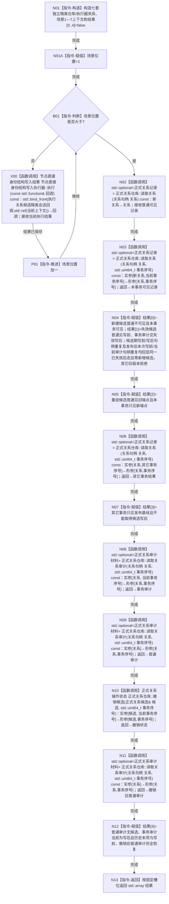

# CORE-RETIRE-P1 CR-F46 验证关系候选隔离矩阵单函数施工流程图

更新时间：2026-07-30
版本：v0.1
代码基线：`57866ac5ca63235ed12da60f635d29f1aacd718b`

## 依据

```text
规范/详细设计/20260730_CORE-RETIRE-P1_函数功能确认_v0.1.md（CR-F16—F19、CR-F23—F29、CR-F46）
规范/详细设计/20260730_CORE-RETIRE-P1_关系反向读取与核心节点退役事务详细设计_v0.1.md（T09—T13）
```

## 身份与边界

本图只对应 CR-F46，验证独立发布基线与候选写后槽的隔离及同事务关系变更精确重复，不把未发布候选写入生产上下文；自检不直接调用关系仓私有核心函数。

## 函数合同

```text
根函数：验证关系候选隔离矩阵
归属模块 / 文件 / 层级：海中鱼巣.核心.自检.节点直接身份结构写入 / 海中鱼巣/核心/自检.节点直接身份结构写入.ixx / 自检内部
现有或待新增：待新增内部自由函数
完整签名：std::array<bool, 5> 验证关系候选隔离矩阵()
参数：无
返回结果：std::array<bool, 5>；槽位0—4依次对应T09—T13
所有权：隔离夹具和候选由本函数栈拥有；候选不越过返回
非法值：无；错事务序号由固定夹具注入
错误语义：每项只产出bool；内部不一致不得算作预期逻辑拒绝
```

## 双向引用

- 调用者：[CR-F20](20260730_CORE-RETIRE-P1_CR-F20_运行节点直接身份结构写入专项源码自检单函数施工流程图_v0.1.md)。
- 主要被调图：[CR-F17](20260730_CORE-RETIRE-P1_CR-F17_形成已发布变更候选单函数施工流程图_v0.1.md)、[CR-F18](20260730_CORE-RETIRE-P1_CR-F18_撤销关系候选单函数施工流程图_v0.1.md)、[CR-F19](20260730_CORE-RETIRE-P1_CR-F19_完成发布关系候选单函数施工流程图_v0.1.md)、[CR-F24](20260730_CORE-RETIRE-P1_CR-F24_结构化创建关系未发布候选单函数施工流程图_v0.1.md)、[CR-F25](20260730_CORE-RETIRE-P1_CR-F25_普通读取关系审计单函数施工流程图_v0.1.md)、[CR-F26](20260730_CORE-RETIRE-P1_CR-F26_事务读取关系审计单函数施工流程图_v0.1.md)、[CR-F28](20260730_CORE-RETIRE-P1_CR-F28_确认关系候选单函数施工流程图_v0.1.md)、[CR-F58](20260730_CORE-RETIRE-P1_CR-F58_登记关系候选单函数施工流程图_v0.1.md)。

## 流程图



## 节点合同

| 节点 | 类型 | 输入 / 输出 | 事实读写 | 后继条件 | 验证 |
| --- | --- | --- | --- | --- | --- |
| N01 | 本函数内指令 | 固定夹具→三类候选 | 只写隔离仓 | 构造完成 | 候选各自独立 |
| N02/N03/N06/N08/N09/N11 | 函数调用 | 关系与可选事务序号 | 可见记录或审计 | 只读隔离仓 | 调用完成 | 普通/本事务/其它事务三视图 |
| N10 | 函数调用 | 候选与当前事务序号 | 撤销状态 | 丢弃隔离候选写后 | 调用完成 | 恢复发布基线 |
| N04/N05/N08/N12 | 本函数内指令 | 实际与预期记录 | T09—T13槽位 | 只写结果 | 断言完成 | 不能把旧新并见算通过 |
| N13 | 本函数内指令 | 5槽位 | 值式数组 | 无 | 无条件 | 长度恰5 |

## 关键边界

```text
关系条目必须具有独立发布基线和候选写后槽；历史尾项不得临时充当发布基线。
错事务拒绝必须零写；发布前普通读者始终只见完整写前态。
```
