# CORE-RETIRE-P1 CR-F47 验证索引反向与移除矩阵单函数施工流程图

更新时间：2026-07-30
版本：v0.1
代码基线：`57866ac5ca63235ed12da60f635d29f1aacd718b`

## 依据

```text
规范/详细设计/20260730_CORE-RETIRE-P1_函数功能确认_v0.1.md（CR-F07—F11、CR-F13、CR-F30—F34、CR-F38、CR-F47）
规范/详细设计/20260730_CORE-RETIRE-P1_关系反向读取与核心节点退役事务详细设计_v0.1.md（T14—T27）
```

## 身份与边界

本图只对应 CR-F47。它验证节点目标索引的反向键组和移除候选生命周期；关系目标种类必须结构化拒绝。

## 函数合同

```text
根函数：验证索引反向与移除矩阵
归属模块 / 文件 / 层级：海中鱼巣.核心.自检.节点直接身份结构写入 / 海中鱼巣/核心/自检.节点直接身份结构写入.ixx / 自检内部
现有或待新增：待新增内部自由函数
完整签名：std::array<bool, 14> 验证索引反向与移除矩阵()
参数：无
返回结果：std::array<bool, 14>；槽位0—13依次对应T14—T27
所有权：隔离索引正反表、候选、会话均由本函数栈拥有
非法值：不完整键、目标不一致、目标种类=关系、事务序号0或错代均作为固定拒绝夹具
错误语义：预期拒绝须零写；目标不可读由公开读取形成内部不一致且不返回半组；重复物理键、同键异目标或目标不可读的权威恢复记录组由公开恢复入口拒绝且旧结构不变。缺正向记录、重复反向键、正反目标错配或非法候选组合不能由公开 API 合法构造，CR-F30/CR-F31 的防御性异常分支另由专项源码静态检查证明存在，不建立自检专用可写后门；合法空结果不能伪装许可失败
```

## 双向引用

- 调用者：[CR-F20](20260730_CORE-RETIRE-P1_CR-F20_运行节点直接身份结构写入专项源码自检单函数施工流程图_v0.1.md)。
- 主要被调图：[CR-F07](20260730_CORE-RETIRE-P1_CR-F07_会话读取目标索引物理键组单函数施工流程图_v0.1.md)、[CR-F08](20260730_CORE-RETIRE-P1_CR-F08_结构化移除索引候选单函数施工流程图_v0.1.md)、[CR-F09](20260730_CORE-RETIRE-P1_CR-F09_确认索引候选单函数施工流程图_v0.1.md)、[CR-F10](20260730_CORE-RETIRE-P1_CR-F10_撤销索引候选单函数施工流程图_v0.1.md)、[CR-F11](20260730_CORE-RETIRE-P1_CR-F11_完成发布索引候选单函数施工流程图_v0.1.md)、[CR-F13](20260730_CORE-RETIRE-P1_CR-F13_会话移除索引候选单函数施工流程图_v0.1.md)、[CR-F30](20260730_CORE-RETIRE-P1_CR-F30_读取目标索引物理键组单函数施工流程图_v0.1.md)、[CR-F34](20260730_CORE-RETIRE-P1_CR-F34_会话读取索引物理键单函数施工流程图_v0.1.md)、[CR-F52](20260730_CORE-RETIRE-P1_CR-F52_结构化创建索引候选单函数施工流程图_v0.1.md)、[CR-F53](20260730_CORE-RETIRE-P1_CR-F53_会话创建索引候选单函数施工流程图_v0.1.md)。

## 流程图

```mermaid
flowchart TD
    N01["N01【指令-构造】经公开创建/执行器形成同节点目标乱序五字段键组、创建/移除/竞争/非法夹具；另形成重复物理键、同键异目标和不可读目标的权威恢复输入；初始化结果[0..13]=false"]
    N01 -- "完成" --> N02["N02【函数调用】std::vector<索引物理键> 可重建索引仓库::读取目标索引物理键组(const 可重建索引目标& 目标) const：实参[目标]→形参[目标]；返回→普通键组"]
    N02 -- "完成" --> N03["N03【函数调用】节点直接身份结构写入结果 节点直接身份结构写入执行器::执行(const std::function<void(节点直接身份结构写入会话&)>& 回调) const：std::bind_front(执行索引候选会话回调,std::ref(场景1或2上下文))→回调；接收执行结果，上下文接收本事务键组与单键读回"]
    N03 -- "完成" --> N03A["N03A【函数调用】bool 可重建索引仓库::从权威记录重建(const std::vector<可重建索引记录>& 记录组, std::uint64_t 事务序号)：实参[重复物理键/同键异目标/不可读目标记录组,事务序号]→形参[记录组,事务序号]；返回→恢复拒绝"]
    N03A -- "恢复拒绝" --> N03B["N03B【函数调用】std::vector<索引物理键> 可重建索引仓库::读取目标索引物理键组(const 可重建索引目标& 目标) const：实参[原目标]→形参[目标]；返回→恢复拒绝后原目标键组"]
    N03B -- "读回完成" --> N04["N04【指令-赋值】结果[0]=F30返回全部节点目标键且五字段升序；结果[1]=本事务创建被F07/F34看见而普通F30不见；结果[2]=本事务移除被F07/F34排除而普通F30仍见；结果[3]=目标不可读抛内部不一致且无半组，畸形恢复输入被拒绝且原正反表保持，合法零命中为空组"]
    N04 -- "完成" --> N05["N05【函数调用】可重建索引写入结果 可重建索引仓库::结构化移除索引候选(const 索引物理键& 键, std::uint64_t 事务序号)：实参[键, 事务序号]→形参[键,事务序号]；返回→移除结果"]
    N05 -- "完成" --> N06["N06【函数调用】std::optional<可重建索引记录> 可重建索引仓库::读取索引物理键(const 索引物理键& 键) const：实参[键]→形参[键]；返回→普通记录"]
    N06 -- "完成" --> N07["N07【函数调用】std::optional<可重建索引记录> 可重建索引仓库::读取索引物理键(const 索引物理键& 键, std::uint64_t 事务序号) const：实参[键,当前事务序号]→形参[键,事务序号]；返回→本事务记录"]
    N07 -- "完成" --> N08["N08【指令-赋值】结果[4]=状态11、写前完整且写后为空；结果[6]=同事务重复移除读回同一后态且无第二候选"]
    N08 -- "完成" --> N09["N09【函数调用】节点直接身份结构写入结果 节点直接身份结构写入执行器::执行(const std::function<void(节点直接身份结构写入会话&)>& 回调) const：std::bind_front(执行索引候选会话回调,std::ref(场景3—5当前上下文))→回调；接收拒绝执行结果"]
    N09 -- "完成" --> N10["N10【指令-赋值】结果[5]=不存在键状态12、候选为空且零写；结果[8]=无效事务/键/非节点目标入口拒绝且零写"]
    N10 -- "完成" --> N11["N11【函数调用】可重建索引操作状态 可重建索引仓库::确认候选(可重建索引候选& 候选, std::uint64_t 事务序号)：实参[候选, 错事务序号]→形参[候选,事务序号]；返回→错代状态"]
    N11 -- "完成" --> N12["N12【函数调用】可重建索引操作状态 可重建索引仓库::确认候选(可重建索引候选& 候选, std::uint64_t 事务序号)：实参[候选, 当前事务序号]→形参[候选,事务序号]；返回→确认状态"]
    N12 -- "完成" --> N13["N13【函数调用】可重建索引操作状态 可重建索引仓库::撤销候选(可重建索引候选& 候选, std::uint64_t 事务序号)：实参[候选, 当前事务序号]→形参[候选,事务序号]；返回→撤销状态"]
    N13 -- "完成" --> N14["N14【指令-赋值】结果[7]=不同事务竞争拒绝且首候选不变；结果[9]=创建确认发布后普通/本事务均命中；结果[10]=移除确认前普通命中而本事务不命中；结果[11]=撤销后两视图恢复同一写前记录"]
    N14 -- "完成" --> N15["N15【函数调用】可重建索引写入结果 可重建索引仓库::结构化移除索引候选(const 索引物理键& 键, std::uint64_t 事务序号)：实参[键, 当前事务序号]→形参[键,事务序号]；返回→第二移除候选"]
    N15 -- "完成" --> N16["N16【函数调用】可重建索引操作状态 可重建索引仓库::确认候选(可重建索引候选& 候选, std::uint64_t 事务序号)：实参[第二移除候选, 当前事务序号]→形参[候选,事务序号]；返回→第二确认状态"]
    N16 -- "完成" --> N17["N17【函数调用】void 可重建索引仓库::完成发布(可重建索引候选& 候选, std::uint64_t 事务序号) noexcept：实参[第二移除候选, 当前事务序号]→形参[候选,事务序号]；返回void"]
    N17 -- "完成" --> N18["N18【函数调用】std::optional<可重建索引记录> 可重建索引仓库::读取索引物理键(const 索引物理键& 键) const：实参[键]→形参[键]；返回→发布后正向结果"]
    N18 -- "完成" --> N19["N19【函数调用】std::vector<索引物理键> 可重建索引仓库::读取目标索引物理键组(const 可重建索引目标& 目标) const：实参[目标]→形参[目标]；返回→发布后反向结果"]
    N19 -- "完成" --> N20["N20【函数调用】bool 可重建索引仓库::清空可重建索引(std::uint64_t 事务序号)：实参[事务序号]→形参[事务序号]；返回→占用/无占用两夹具清空结果"]
    N20 -- "完成" --> N21["N21【函数调用】bool 可重建索引仓库::从权威记录重建(const std::vector<可重建索引记录>& 记录组, std::uint64_t 事务序号)：实参[记录组, 事务序号]→形参[记录组,事务序号]；返回→占用/无占用两夹具重建结果"]
    N21 -- "完成" --> N22["N22【指令-赋值】结果[12]=移除发布后正反均不命中且候选已发布；结果[13]=任一候选占用时清空/重建拒绝零写，无候选重建正反一致"]
    N22 -- "完成" --> N23["N23【指令-返回】按固定槽位返回 std::array<bool,14> 结果"]
```



## 节点合同

| 节点 | 类型 | 输入 / 输出 | 事实读写 | 后继条件 | 验证 |
| --- | --- | --- | --- | --- | --- |
| N01 | 本函数内指令 | 固定材料 | 隔离正反表与结果 | 构造完成 | 五字段排序输入故意乱序 |
| N02/N03/N03A/N03B/N06/N07/N18/N19 | 函数调用 | `可重建索引目标`、键、可选事务、畸形恢复记录组 | 键组、记录或恢复拒绝 | 公开创建/恢复/读取形成的隔离视图 | 调用完成 | 空、不可读目标与恢复拒绝必须区分 |
| N05/N09/N11—N13/N15—N17/N20/N21 | 函数调用 | 键、候选、记录组、事务序号 | 状态/候选 | 只写隔离索引 | 调用完成 | 候选全生命周期与重建门禁 |
| N04/N08/N10/N14/N22 | 本函数内指令 | 实际状态与正反快照 | 固定布尔槽位 | 只写结果 | 断言完成 | T14—T27顺序不变 |
| N23 | 本函数内指令 | 14槽位 | 值式数组 | 无 | 无条件 | 长度恰14 |

## 关键边界

```text
创建候选写前为空、写后有值；移除候选写前有值、写后为空。
移除候选发布前普通读取保持命中，本事务读取不命中；撤销必须同时恢复正向与反向绑定。
自检经公开执行器回调取得会话；直接仓库候选夹具只使用仓库公开函数和自检自有事务序号，不调用 CR-F31 私有核心。
自检不得为构造缺正向记录、正反目标错配、重复反向键或非法候选组合而新增 friend、私有容器访问器或自检专用生产写入口；公开可表达的重复物理键、同键异目标和不可读目标由 `从权威记录重建` 的拒绝与旧结构不变验证，公开不可表达的内存不变量仅由 CR-F30/CR-F31 防御分支及计划静态命令核对。
```
