# CORE-RETIRE-P1 CR-F48 验证节点删除矩阵单函数施工流程图

更新时间：2026-07-30
版本：v0.1
代码基线：`57866ac5ca63235ed12da60f635d29f1aacd718b`

## 依据

```text
规范/详细设计/20260730_CORE-RETIRE-P1_函数功能确认_v0.1.md（CR-F04—F07、CR-F12、CR-F34、CR-F48）
规范/详细设计/20260730_CORE-RETIRE-P1_关系反向读取与核心节点退役事务详细设计_v0.1.md（T28—T34）
```

## 身份与边界

本图只对应 CR-F48。它通过现有写执行器公开入口验证会话仅在本事务关系和节点目标索引视图均为空后登记节点删除候选；自检只观察公开操作结果、事务内读回和发布/撤销后审计，不直接取得会话私有写集或候选引用。

## 函数合同

```text
根函数：验证节点删除矩阵
归属模块 / 文件 / 层级：海中鱼巣.核心.自检.节点直接身份结构写入 / 海中鱼巣/核心/自检.节点直接身份结构写入.ixx / 自检内部
现有或待新增：待新增内部自由函数
完整签名：std::array<bool, 7> 验证节点删除矩阵()
参数：无
返回结果：std::array<bool, 7>；槽位0—6依次对应T28—T34
所有权：隔离仓、会话和删除候选由本函数栈拥有
非法值：无效句柄、仍有关联关系、仍有目标索引
错误语义：具名入口拒绝或版本漂移必须零写；候选双句柄不连续属于内部不一致
```

## 双向引用

- 调用者：[CR-F20](20260730_CORE-RETIRE-P1_CR-F20_运行节点直接身份结构写入专项源码自检单函数施工流程图_v0.1.md)。
- 主要被调图：[CR-F12](20260730_CORE-RETIRE-P1_CR-F12_会话删除节点候选单函数施工流程图_v0.1.md)、[CR-F04](20260730_CORE-RETIRE-P1_CR-F04_会话读取指向有效关系组单函数施工流程图_v0.1.md)、[CR-F05](20260730_CORE-RETIRE-P1_CR-F05_会话读取相关有效关系组单函数施工流程图_v0.1.md)、[CR-F07](20260730_CORE-RETIRE-P1_CR-F07_会话读取目标索引物理键组单函数施工流程图_v0.1.md)、[CR-F34](20260730_CORE-RETIRE-P1_CR-F34_会话读取索引物理键单函数施工流程图_v0.1.md)。

## 流程图

```mermaid
flowchart TD
    N01["N01【指令-构造】分别构造关系仍有效、索引仍有效、精确重复后撤销、单次撤销、正常发布和无效句柄六个隔离执行器夹具；初始化结果[0..6]=false"]
    N01 -- "完成" --> N02["N02【函数调用】节点直接身份结构写入结果 节点直接身份结构写入执行器::执行(const std::function<void(节点直接身份结构写入会话&)>& 回调) const：std::bind_front(执行节点删除会话回调,std::ref(场景1上下文))→回调；接收关系残留执行结果"]
    N02 -- "完成" --> N03["N03【指令-赋值】结果[0]=入口拒绝且节点/关系/写集零变化"]
    N03 -- "完成" --> N04["N04【函数调用】节点直接身份结构写入结果 节点直接身份结构写入执行器::执行(const std::function<void(节点直接身份结构写入会话&)>& 回调) const：std::bind_front(执行节点删除会话回调,std::ref(场景2上下文))→回调；接收索引残留执行结果"]
    N04 -- "完成" --> N05["N05【指令-赋值】结果[1]=入口拒绝且节点/索引/写集零变化"]
    N05 -- "完成" --> N06["N06【函数调用】节点直接身份结构写入结果 节点直接身份结构写入执行器::执行(const std::function<void(节点直接身份结构写入会话&)>& 回调) const：std::bind_front(执行节点删除会话回调,std::ref(场景3上下文))→回调；接收执行结果，上下文接收两次删除与事务读回"]
    N06 -- "完成" --> N10["N10【指令-赋值】结果[2]=首次已提交且输入写前节点普通有效；结果[3]=写后同仓同编号版本+1、事务内写前/写后均不命中，第二次幂等回显同一写后节点"]
    N10 -- "完成" --> N11["N11【函数调用】节点直接身份结构写入结果 节点直接身份结构写入执行器::执行(const std::function<void(节点直接身份结构写入会话&)>& 回调) const：std::bind_front(执行节点删除会话回调,std::ref(场景4上下文))→回调；接收撤销执行结果"]
    N11 -- "完成" --> N13["N13【指令-赋值】结果[4]=撤销后写前句柄恢复普通有效读取"]
    N13 -- "完成" --> N14["N14【函数调用】节点直接身份结构写入结果 节点直接身份结构写入执行器::执行(const std::function<void(节点直接身份结构写入会话&)>& 回调) const：std::bind_front(执行节点删除会话回调,std::ref(场景5上下文))→回调；接收提交执行结果"]
    N14 -- "完成" --> N16["N16【函数调用】std::optional<节点直接身份记录> 节点直接身份仓库::读取节点(节点句柄 节点) const：实参[发布写前句柄]→形参[节点]；返回→发布后普通结果"]
    N16 -- "完成" --> N17["N17【函数调用】std::optional<节点直接身份记录> 节点直接身份仓库::读取节点审计(节点句柄 节点) const：实参[发布写后句柄]→形参[节点]；返回→发布后审计结果"]
    N17 -- "完成" --> N18["N18【指令-赋值】结果[5]=发布后写前普通不命中且写后审计为已删除版本"]
    N18 -- "完成" --> N19["N19【函数调用】节点直接身份结构写入结果 节点直接身份结构写入执行器::执行(const std::function<void(节点直接身份结构写入会话&)>& 回调) const：std::bind_front(执行节点删除会话回调,std::ref(场景6上下文))→回调；接收无效句柄执行结果"]
    N19 -- "完成" --> N20["N20【指令-赋值】结果[6]=入口拒绝且节点/关系/索引审计前后完全一致"]
    N20 -- "完成" --> N21["N21【指令-返回】按固定槽位返回 std::array<bool,7> 结果"]
```



## 节点合同

| 节点 | 类型 | 输入 / 输出 | 事实读写 | 后继条件 | 验证 |
| --- | --- | --- | --- | --- | --- |
| N01 | 本函数内指令 | 固定夹具 | 六个隔离事务 | 构造完成 | 各夹具不共享候选 |
| N02/N04/N06/N11/N14/N16/N17/N19 | 函数调用 | 具名节点、公开执行器回调、结果或句柄 | 状态、句柄或记录 | 仅写隔离候选/发布事实 | 调用完成 | T28—T34 |
| N03/N05/N10/N13/N18/N20 | 本函数内指令 | 状态与快照 | 固定布尔槽位 | 只写结果 | 断言完成 | 槽位0—6固定 |
| N21 | 本函数内指令 | 7槽位 | 值式数组 | 无 | 无条件 | 长度恰7 |

## 关键边界

```text
有任何有效关系或节点目标索引时不得登记删除候选。
发布前不存在可由仓库普通读取按写后句柄取得的“已删除记录”；自检通过 CR-F12 值式回显、CR-F55 事务内不命中及发布/撤销后审计验证，不越过会话私有边界。
本包不代替领域类型化记录退役；存在必需领域记录的节点仍由后继强类型参与者包处理。
```
