# CORE-RETIRE-P1 CR-F49 验证确认撤销故障矩阵单函数施工流程图

更新时间：2026-07-30
版本：v0.1
代码基线：`57866ac5ca63235ed12da60f635d29f1aacd718b`

## 依据

```text
规范/详细设计/20260730_CORE-RETIRE-P1_函数功能确认_v0.1.md（CR-F14—F15、CR-F35—F38、CR-F49）
规范/详细设计/20260730_CORE-RETIRE-P1_关系反向读取与核心节点退役事务详细设计_v0.1.md（T35—T45）
```

## 身份与边界

本图只对应 CR-F49，验证六类核心写集的读回门禁、确认顺序、逆序撤销、发布顺序与撤销失败隔离。

## 函数合同

```text
根函数：验证确认撤销故障矩阵
归属模块 / 文件 / 层级：海中鱼巣.核心.自检.节点直接身份结构写入 / 海中鱼巣/核心/自检.节点直接身份结构写入.ixx / 自检内部
现有或待新增：待新增内部自由函数
完整签名：std::array<bool, 11> 验证确认撤销故障矩阵()
参数：无
返回结果：std::array<bool, 11>；槽位0—10依次对应T35—T45
所有权：每个故障点使用独立事务域、仓库、执行器与候选；返回前销毁
非法值：空写集、未读回写集、错误仓库/事务候选及现有参与者撤销故障
错误语义：错误归属/事务确认必须零发布；显式撤销必须恢复前态；参与者撤销失败必须隔离事务域
```

## 双向引用

- 调用者：[CR-F20](20260730_CORE-RETIRE-P1_CR-F20_运行节点直接身份结构写入专项源码自检单函数施工流程图_v0.1.md)。
- 主要被调图：[CR-F14](20260730_CORE-RETIRE-P1_CR-F14_会话完成确认单函数施工流程图_v0.1.md)、[CR-F15](20260730_CORE-RETIRE-P1_CR-F15_会话完成撤销单函数施工流程图_v0.1.md)、[CR-F35](20260730_CORE-RETIRE-P1_CR-F35_全部写集已读回单函数施工流程图_v0.1.md)、[CR-F36](20260730_CORE-RETIRE-P1_CR-F36_全部写集为空单函数施工流程图_v0.1.md)、[CR-F37](20260730_CORE-RETIRE-P1_CR-F37_会话完成发布单函数施工流程图_v0.1.md)、[CR-F38](20260730_CORE-RETIRE-P1_CR-F38_转换索引结果单函数施工流程图_v0.1.md)。

## 流程图

```mermaid
flowchart TD
    N01["N01【指令-构造】构造六写集完整、未读回、关系/索引创建/索引移除/节点删除错误归属或事务、候选移动、显式撤销、参与者撤销故障、空写集和成功发布隔离夹具；初始化结果[0..10]=false"]
    N01 -- "完成" --> N02["N02【函数调用】节点直接身份结构写入结果 节点直接身份结构写入执行器::执行(const std::function<void(节点直接身份结构写入会话&)>& 回调) const：std::bind_front(执行六写集故障会话回调,std::ref(场景1上下文))→回调；接收提交结果"]
    N02 -- "完成" --> N04["N04【指令-赋值】结果[0]=六写集精确读回、执行结果已提交且发布后六类事实均命中预期后态"]
    N04 -- "完成" --> N05["N05【函数调用】节点直接身份结构写入结果 节点直接身份结构写入执行器::执行(const std::function<void(节点直接身份结构写入会话&)>& 回调) const：std::bind_front(执行六写集故障会话回调,std::ref(场景2上下文))→回调；接收漏读失败结果"]
    N05 -- "完成" --> N06["N06【指令-赋值】结果[1]=内部不一致并触发撤销"]
    N06 -- "完成" --> N07["N07【函数调用】正式关系操作状态 正式关系仓库::确认候选(正式关系候选& 候选, std::uint64_t 事务序号)：实参[关系候选,错误事务]→形参[候选,事务序号]；返回→错误事务确认状态"]
    N07 -- "拒绝且零发布" --> N07A["N07A【函数调用】正式关系操作状态 正式关系仓库::撤销候选(正式关系候选& 候选, std::uint64_t 事务序号)：实参[关系候选,正确事务]→形参[候选,事务序号]；返回→正确撤销状态"]
    N07A -- "撤销完成" --> N07B["N07B【函数调用】std::optional<正式关系审计材料> 正式关系仓库::读取关系审计(关系句柄 关系) const：实参[关系候选写前关系]→形参[关系]；返回→撤销后普通审计"]
    N07B -- "读回完成" --> N08["N08【指令-赋值】结果[2]=错误事务确认零发布且正确撤销恢复关系前态"]
    N08 -- "完成" --> N09["N09【函数调用】可重建索引操作状态 可重建索引仓库::确认候选(可重建索引候选& 候选, std::uint64_t 事务序号)：调用对象=错误索引仓库；实参[创建候选,正确事务]→形参[候选,事务序号]；返回→错误仓库确认状态"]
    N09 -- "拒绝且零发布" --> N09A["N09A【函数调用】可重建索引操作状态 可重建索引仓库::撤销候选(可重建索引候选& 候选, std::uint64_t 事务序号)：调用对象=创建仓；实参[创建候选,正确事务]→形参[候选,事务序号]；返回→正确撤销状态"]
    N09A -- "撤销完成" --> N09B["N09B【函数调用】std::optional<可重建索引记录> 可重建索引仓库::读取索引物理键(const 索引物理键& 键) const：实参[创建候选写后键]→形参[键]；返回→撤销后正向记录"]
    N09B -- "读回完成" --> N10["N10【指令-赋值】结果[3]=错误仓库确认拒绝且创建候选正确撤销恢复不存在"]
    N10 -- "完成" --> N11["N11【函数调用】可重建索引操作状态 可重建索引仓库::确认候选(可重建索引候选& 候选, std::uint64_t 事务序号)：调用对象=错误索引仓库；实参[移除候选,正确事务]→形参[候选,事务序号]；返回→错误仓库确认状态"]
    N11 -- "拒绝且零发布" --> N11A["N11A【函数调用】可重建索引操作状态 可重建索引仓库::撤销候选(可重建索引候选& 候选, std::uint64_t 事务序号)：调用对象=创建仓；实参[移除候选,正确事务]→形参[候选,事务序号]；返回→正确撤销状态"]
    N11A -- "撤销完成" --> N11B["N11B【函数调用】std::optional<可重建索引记录> 可重建索引仓库::读取索引物理键(const 索引物理键& 键) const：实参[移除候选写前键]→形参[键]；返回→撤销后正向记录"]
    N11B -- "读回完成" --> N12["N12【指令-赋值】结果[4]=错误仓库确认拒绝且移除候选正确撤销恢复写前"]
    N12 -- "完成" --> N13["N13【函数调用】节点直接身份操作结果 节点直接身份仓库::确认节点删除候选(节点直接身份删除未发布候选& 候选, std::uint64_t 事务序号)：实参[删除候选,错误事务]→形参[候选,事务序号]；返回→错误事务确认状态"]
    N13 -- "拒绝且零发布" --> N13A["N13A【函数调用】节点直接身份操作结果 节点直接身份仓库::撤销节点删除候选(节点直接身份删除未发布候选& 候选, std::uint64_t 事务序号)：实参[删除候选,正确事务]→形参[候选,事务序号]；返回→正确撤销状态"]
    N13A -- "撤销完成" --> N13B["N13B【函数调用】std::optional<节点直接身份记录> 节点直接身份仓库::读取节点(节点句柄 节点) const：实参[删除候选写前节点]→形参[节点]；返回→撤销后节点记录"]
    N13B -- "读回完成" --> N14["N14【指令-赋值】结果[5]=错误事务确认零发布且正确撤销恢复节点前态"]
    N14 -- "完成" --> N15["N15【指令-移动】分别把关系候选和索引候选移动到目标对象；来源对象归属与事务清空"]
    N15 -- "候选已移动" --> N15A["N15A【函数调用】正式关系操作状态 正式关系仓库::确认候选(正式关系候选& 候选, std::uint64_t 事务序号)：实参[关系来源候选,正确事务]→形参[候选,事务序号]；返回→关系来源拒绝状态"]
    N15A -- "来源拒绝" --> N15B["N15B【函数调用】正式关系操作状态 正式关系仓库::撤销候选(正式关系候选& 候选, std::uint64_t 事务序号)：实参[关系目标候选,正确事务]→形参[候选,事务序号]；返回→关系目标撤销状态"]
    N15B -- "撤销完成" --> N15C["N15C【函数调用】可重建索引操作状态 可重建索引仓库::确认候选(可重建索引候选& 候选, std::uint64_t 事务序号)：实参[索引来源候选,正确事务]→形参[候选,事务序号]；返回→索引来源拒绝状态"]
    N15C -- "来源拒绝" --> N15D["N15D【函数调用】可重建索引操作状态 可重建索引仓库::撤销候选(可重建索引候选& 候选, std::uint64_t 事务序号)：实参[索引目标候选,正确事务]→形参[候选,事务序号]；返回→索引目标撤销状态"]
    N15D -- "撤销完成" --> N16["N16【指令-赋值】结果[6]=移动后来源归属/事务清空且被拒绝，目标候选仍由创建仓正确撤销"]
    N16 -- "完成" --> N17["N17【函数调用】节点直接身份结构写入结果 节点直接身份结构写入执行器::执行(const std::function<void(节点直接身份结构写入会话&)>& 回调) const：std::bind_front(执行六写集故障会话回调,std::ref(场景3上下文))→回调；接收显式撤销结果"]
    N17 -- "完成" --> N18["N18【指令-赋值】结果[7]=撤销结果为候选已撤销且六类普通前态全部恢复"]
    N18 -- "完成" --> N19["N19【函数调用】节点直接身份结构写入结果 节点直接身份结构写入执行器::执行(const std::function<void(节点直接身份结构写入会话&)>& 回调,std::span<节点直接身份结构写入事务参与者* const> 参与者组) const：std::bind_front(执行六写集故障会话回调,std::ref(场景4上下文))→回调,撤销失败参与者组→参与者组；接收隔离结果"]
    N19 -- "完成" --> N20["N20【指令-赋值】结果[8]=参与者撤销失败后核心仍撤销、事务域隔离且后继读写许可拒绝"]
    N20 -- "完成" --> N21["N21【函数调用】节点直接身份结构写入结果 节点直接身份结构写入执行器::执行(const std::function<void(节点直接身份结构写入会话&)>& 回调) const：std::bind_front(执行六写集故障会话回调,std::ref(场景5上下文))→回调；接收空写集结果"]
    N21 -- "完成" --> N22["N22【指令-赋值】结果[9]=普通结构事务入口拒绝且仅参与者事务合同不变"]
    N22 -- "完成" --> N23["N23【函数调用】节点直接身份结构写入结果 节点直接身份结构写入执行器::执行(const std::function<void(节点直接身份结构写入会话&)>& 回调) const：std::bind_front(执行六写集故障会话回调,std::ref(场景6上下文))→回调；接收正常发布结果"]
    N23 -- "完成" --> N24["N24【指令-赋值】结果[10]=执行结果已提交且六写集发布后态经普通读回一次完整可见"]
    N24 -- "完成" --> N25["N25【指令-返回】按固定槽位返回 std::array<bool,11> 结果"]
```



## 节点合同

| 节点 | 类型 | 输入 / 输出 | 事实读写 | 后继条件 | 验证 |
| --- | --- | --- | --- | --- | --- |
| N01 | 本函数内指令 | 固定故障矩阵 | 隔离事务组 | 构造完成 | 每个故障点独立 |
| N02/N05/N07/N07A/N07B/N09/N09A/N09B/N11/N11A/N11B/N13/N13A/N13B/N15A—N15D/N17/N19/N21/N23 | 函数调用 | 具名夹具、公开执行器、仓库候选或固定回调 | 状态、前态与后态快照 | 仅写隔离事务 | 调用完成 | T35—T45 |
| N15 | 本函数内指令 | 两类来源候选与目标对象 | 只移动候选所有权并清空来源归属 | 隔离夹具 | 移动完成 | 不夹带确认或撤销调用 |
| N04/N06/N08/N10/N12/N14/N16/N18/N20/N22/N24 | 本函数内指令 | 状态、快照、计数 | 固定布尔槽位 | 只写结果 | 断言完成 | 槽位0—10固定 |
| N25 | 本函数内指令 | 11槽位 | 值式数组 | 无 | 无条件 | 长度恰11 |

## 关键边界

```text
确认顺序与撤销顺序必须互为严格逆序；CR-F49 不越过会话私有边界，顺序由 CR-F14/CR-F15/CR-F37 源码静态核对，运行夹具只验证完整前态/后态。
候选错误仓库/事务和移动后来源对象都必须被真实接口拒绝；不得使用当前代码不存在的核心确认点或分配故障注入器。
参与者撤销失败不是普通逻辑拒绝，必须使事务域进入隔离并阻止后续许可。
```
