# CORE-RETIRE-P1 CR-F50 验证统一可见点与日志边界单函数施工流程图

更新时间：2026-07-30
版本：v0.1
代码基线：`57866ac5ca63235ed12da60f635d29f1aacd718b`

## 依据

```text
规范/详细设计/20260730_CORE-RETIRE-P1_函数功能确认_v0.1.md（CR-F39—F44、CR-F50、CR-F56；读取结果ABI、批量读取与日志合同）
规范/详细设计/20260730_CORE-RETIRE-P1_关系反向读取与核心节点退役事务详细设计_v0.1.md（T46—T47）
```

## 身份与边界

本图只对应 CR-F50。T46 先以一个 CR-F56 批量请求，在一次共享许可内读取一个节点、四类关系查询和一个索引目标，证明三组结果对齐同一完整发布后态；随后调用 CR-F39—F44 六个单项包装并逐项复核与批量对应子结果一致。T47 只验证专项日志关闭时内容参数零求值、开启时只写人读日志且不改变本地机器结果。F51 的正式登记与程序结果属于外层 V48，不进入本函数数组或74项报告。

## 函数合同

```text
根函数：验证统一可见点与日志边界
归属模块 / 文件 / 层级：海中鱼巣.核心.自检.节点直接身份结构写入 / 海中鱼巣/核心/自检.节点直接身份结构写入.ixx / 自检内部
现有或待新增：待新增内部自由函数
完整签名：std::array<bool, 2> 验证统一可见点与日志边界()
参数：无
返回结果：std::array<bool, 2>；槽位0=T46，槽位1=T47；调用方拥有值式数组
所有权：读取服务仅借用本函数隔离事务域和三仓；CR-F56 的一次共享许可覆盖批量三组读取，六个单项包装各自取得并释放共享许可；日志文本为人读临时值
非法值：服务任一依赖为空、无效句柄或许可无效形成固定拒绝夹具
错误语义：节点未命中与许可拒绝分离；合法空关系/索引组为已读取+空vector；日志不得影响结果
```

## 双向引用

- 调用者：[CR-F20](20260730_CORE-RETIRE-P1_CR-F20_运行节点直接身份结构写入专项源码自检单函数施工流程图_v0.1.md)。
- 被调图：[CR-F56](20260730_CORE-RETIRE-P1_CR-F56_读取服务批量读取单函数施工流程图_v0.1.md)、[CR-F39](20260730_CORE-RETIRE-P1_CR-F39_读取服务读取节点单函数施工流程图_v0.1.md)、[CR-F40](20260730_CORE-RETIRE-P1_CR-F40_读取服务读取有效关系组单函数施工流程图_v0.1.md)、[CR-F41](20260730_CORE-RETIRE-P1_CR-F41_读取服务读取指向有效关系组单函数施工流程图_v0.1.md)、[CR-F42](20260730_CORE-RETIRE-P1_CR-F42_读取服务读取相关有效关系组单函数施工流程图_v0.1.md)、[CR-F43](20260730_CORE-RETIRE-P1_CR-F43_读取服务读取有效类型角色关系组单函数施工流程图_v0.1.md)、[CR-F44](20260730_CORE-RETIRE-P1_CR-F44_读取服务读取目标索引物理键组单函数施工流程图_v0.1.md)。

## 流程图

```mermaid
flowchart TD
    N01["N01【指令-构造】构造隔离事务域、三仓、有效读取服务、空依赖服务与发布前后结构快照；初始化结果[0..1]=false"]
    N01 -- "完成" --> N02["N02【指令-构造】批量请求={节点组:[节点],关系查询组:[按源,按目标,按相关节点,按类型角色],索引目标组:[目标]}；输入顺序固定"]
    N02 -- "完成" --> N03["N03【函数调用】节点直接身份结构批量读取结果 节点直接身份结构读取服务::批量读取(const 节点直接身份结构批量读取请求& 请求) const：实参[批量请求]→形参[请求]；返回→批量结果"]
    N03 -- "完成" --> N04{"N04【指令-判断】批量外层已读取，节点/关系/索引结果长度为1/4/1、顺序对齐且三组属于同一完整发布后态"}
    N04 -- "否" --> N05["N05【指令-赋值】批量主证据通过=false"]
    N04 -- "是" --> N06["N06【指令-赋值】批量主证据通过=true；节点未命中、合法空组、许可拒绝仍可区分"]
    N05 -- "完成" --> N07["N07【函数调用】节点直接身份结构读取结果<节点直接身份记录> 节点直接身份结构读取服务::读取节点(节点句柄 节点) const：实参[节点]→形参[节点]；返回→单项节点结果"]
    N06 -- "完成" --> N07
    N07 -- "完成" --> N08["N08【函数调用】节点直接身份结构读取结果<std::vector<正式关系记录>> 节点直接身份结构读取服务::读取有效关系组(节点句柄 源节点, 关系类型 类型) const：实参[源节点, 类型]→形参[源节点,类型]；返回→单项按源结果"]
    N08 -- "完成" --> N09["N09【函数调用】节点直接身份结构读取结果<std::vector<正式关系记录>> 节点直接身份结构读取服务::读取指向有效关系组(节点句柄 目标节点, 关系类型 类型) const：实参[目标节点, 类型]→形参[目标节点,类型]；返回→单项按目标结果"]
    N09 -- "完成" --> N10["N10【函数调用】节点直接身份结构读取结果<std::vector<正式关系记录>> 节点直接身份结构读取服务::读取相关有效关系组(节点句柄 节点, 关系类型 类型) const：实参[节点, 类型]→形参[节点,类型]；返回→单项相关结果"]
    N10 -- "完成" --> N11["N11【函数调用】节点直接身份结构读取结果<std::vector<正式关系记录>> 节点直接身份结构读取服务::读取有效类型角色关系组(关系类型 类型, std::int64_t 顺序号) const：实参[类型, 顺序号]→形参[类型,顺序号]；返回→单项类型角色结果"]
    N11 -- "完成" --> N12["N12【函数调用】节点直接身份结构读取结果<std::vector<索引物理键>> 节点直接身份结构读取服务::读取目标索引物理键组(const 可重建索引目标& 目标) const：实参[目标]→形参[目标]；返回→单项索引结果"]
    N12 -- "完成" --> N13{"N13【指令-判断】六个单项状态和值是否分别等于批量节点[0]、关系[0..3]、索引[0]"}
    N13 -- "否" --> N14["N14【指令-赋值】结果[0]=false"]
    N13 -- "是" --> N15["N15【指令-赋值】结果[0]=批量主证据通过"]
    N14 -- "完成" --> N16["N16【指令-赋值】日志参数求值计数=0"]
    N15 -- "完成" --> N16
    N16 -- "完成" --> N17["N17【指令-宏调用】执行 海中鱼巣记录节点直接身份结构自检调试日志(模块常量,入口常量,(++日志参数求值计数,内容))；宏关闭时第三实参零求值"]
    N17 -- "完成" --> N18{"N18【指令-判断】HY_EGO_DEBUG_LOG_SELF_TEST_NODE_DIRECT_IDENTITY 是否定义"}
    N18 -- "未定义" --> N19["N19【指令-赋值】结果[1]=(日志参数求值计数==0)"]
    N18 -- "已定义" --> N20["N20【指令-赋值】结果[1]=(日志仅写人读内容且批量/单项结果、74项报告、失败数量、退出码和机器事实均未改变)"]
    N19 -- "完成" --> N21["N21【指令-返回】按固定槽位返回 std::array<bool,2> 结果"]
    N20 -- "完成" --> N21
```



## 节点合同

| 节点 | 类型 | 输入 | 输出 | 事实读写 | 后继条件 | 验证 |
| --- | --- | --- | --- | --- | --- | --- |
| N01 | 本函数内指令 | 固定隔离材料 | 本地服务和快照 | 只构造本地夹具 | 构造完成 | 依赖均为借用 |
| N02 | 本函数内指令 | 一个节点、四类关系参数、一个索引目标 | 对齐批量请求 | 只写本地请求 | 构造完成 | 输入顺序固定 |
| N03 | 函数调用 | 批量请求 | 三组批量结果 | 一次共享许可内只读三仓发布事实 | 调用完成 | T46主证据 |
| N04—N06 | 本函数内指令 | 批量状态、长度、顺序和值 | 批量主证据 | 只写本地布尔值 | 分支汇合 | 三组同一完整后态 |
| N07—N12 | 函数调用 | 六个对应单项请求 | 六个结构化单项结果 | 各自共享许可内只读发布事实 | 单次调用完成 | 包装一致性 |
| N13—N15 | 本函数内指令 | 批量与单项对应子结果 | 结果[0] | 只写结果 | 分支汇合 | 状态和值均相等 |
| N16 | 本函数内指令 | 无 | 求值计数=0 | 只写本地计数 | 赋值完成 | 固定初值 |
| N17 | 函数调用 | 模块、入口、带副作用内容表达式 | 无机器结果 | 至多写人读日志 | 调用完成 | T47 |
| N18—N20 | 本函数内指令 | 编译期开关与计数/快照 | 结果[1] | 只写结果 | 分支汇合 | 关闭零求值；开启零机器影响 |
| N21 | 本函数内指令 | 2槽位 | 值式数组 | 无 | 无条件 | 长度恰2 |

## 关键边界

```text
T46 的统一可见点只由 CR-F56 一次共享许可批量读取证明；六个单项包装只证明与批量对应子结果一致，不能单独替代跨仓同点证据。
上层不得接触共享许可、令牌、仓库锁或会话；每次读取服务公开调用自行取得且释放共享许可。
宏关闭时内容参数必须不求值；开启时日志只承载人读诊断，不得改变任何机器事实或验收结果。
```
