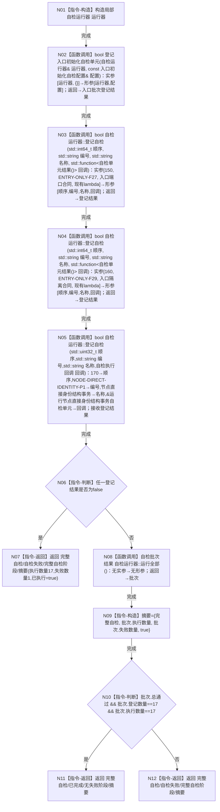

# CORE-RETIRE-P1 CR-F51 运行完整自检模式单函数施工流程图

更新时间：2026-07-30
版本：v0.1
代码基线：`57866ac5ca63235ed12da60f635d29f1aacd718b`

## 依据

```text
规范/详细设计/20260730_CORE-RETIRE-P1_函数功能确认_v0.1.md（CR-F20、CR-F51）
当前实现：海中鱼巣/启动.应用程序.ixx:379（当前登记/执行数量16）
目标专项入口：海中鱼巣/核心/自检.节点直接身份结构写入.ixx:663
```

## 身份与边界

本图只对应现有 CR-F51。唯一改动语义是在现有完整自检运行器中，以顺序 `170`、稳定编号 `NODE-DIRECT-IDENTITY-P1` 登记 CR-F20，并把成功门禁的登记/执行数量从16精确改为17。

## 函数合同

```text
根函数：运行完整自检模式
归属模块 / 文件 / 层级：海中鱼巣.启动.应用程序 / 海中鱼巣/启动.应用程序.ixx / 启动模式编排层
现有或待新增：现有模块内部自由函数改造（当前约第379行）
完整签名：程序运行结果 运行完整自检模式()
参数：无
返回结果：程序运行结果；成功为启动模式::完整自检/程序运行状态::已完成/失败阶段::无；否则为自检失败并保留批次摘要
所有权：运行器与批次结果由本函数栈拥有；CR-F20返回报告由具名 CR-F64 值式接收并转换为现有自检单元结果
非法值：无入口参数；登记失败、登记数或执行数不等于17、任一自检失败均走现有自检失败结果
错误语义：登记失败固定摘要执行数量17、失败数量1；运行失败使用真实批次执行/失败数量，不伪造成功
```

## 双向引用

- 调用者：`运行应用程序(启动参数)` 的 `启动模式::完整自检` 分支。
- 被调图：[CR-F20](20260730_CORE-RETIRE-P1_CR-F20_运行节点直接身份结构写入专项源码自检单函数施工流程图_v0.1.md)。
- 其它既有16个自检单元保持原身份、顺序和调用合同，本图不重新设计它们。

## 流程图



## 节点合同

| 节点 | 类型 | 参数 / 输入绑定 | 结果 / 输出绑定 | 事实读写 | 后继条件 | 验证 |
| --- | --- | --- | --- | --- | --- | --- |
| N01 | 本函数内指令 | 无 | 局部运行器 | 只写函数栈 | 构造完成 | 不保存全局状态 |
| N02—N05 | 函数调用 | 运行器、顺序、稳定编号、标题、lambda | bool登记结果 | 只写局部运行器登记表 | 调用完成 | 新项仅顺序170/编号NODE-DIRECT-IDENTITY-P1 |
| N06—N07 | 本函数内指令 | 四组登记结果 | 固定失败结果 | 无机器事实写入 | 有失败即返回 | 数量17 |
| N08 | 函数调用 | 局部运行器 | 批次结果 | 执行已登记自检 | 调用完成 | CR-F20只执行一次 |
| N09—N12 | 本函数内指令 | 批次 | 程序运行结果 | 只构造返回值 | 判断分支 | 登记数与执行数均须17 |

## 关键边界

```text
CR-F20 的稳定编号固定为 NODE-DIRECT-IDENTITY-P1，顺序固定为170。
CR-F64 把 CR-F20 报告精确转换为 `自检单元结果{"NODE-DIRECT-IDENTITY-P1", "节点直接身份结构事务", 报告.总通过, 报告.验收.size(), 报告.失败数量}`，不重新计算或丢弃失败数；本函数不保留登记 lambda。
现有16项的身份与相对顺序不变；新总数精确为17。
运行器结果只证明自检执行事实，不改变生产机器事实或计划状态。
顺序170、稳定编号、登记/执行数量17及程序结果由独立外层 V48 验收，不回填或伪装成 F50 的 T47，也不占用74项报告槽位。
```
