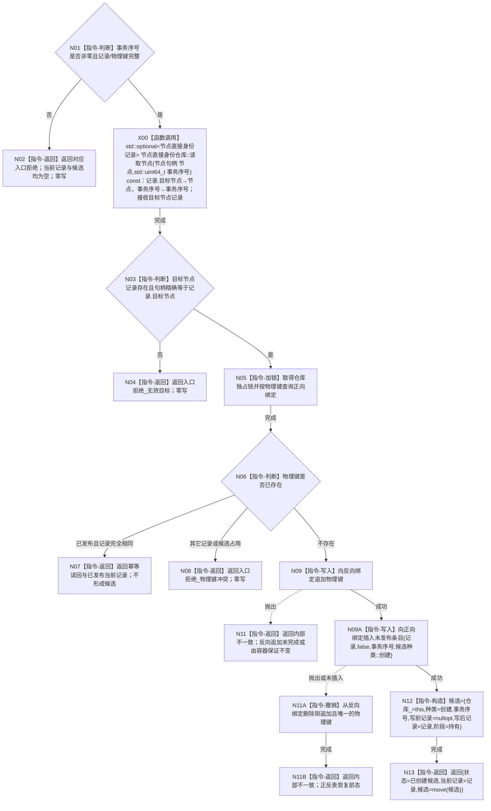

# CORE-RETIRE-P1 CR-F52 结构化创建索引候选单函数施工流程图

更新时间：2026-07-30
版本：v0.1
代码基线：`57866ac5ca63235ed12da60f635d29f1aacd718b`

## 依据

```text
规范/详细设计/20260730_CORE-RETIRE-P1_函数功能确认_v0.1.md（CR-F52、可重建索引候选种类与optional合同）
规范/详细设计/20260730_CORE-RETIRE-P1_逐函数逐节点实现分析_v0.1.md（CR-F52 N01—N09）
当前函数：海中鱼巣/核心/仓库.可重建索引.ixx:135
```

## 身份与边界

本图只对应 CR-F52。它原位改造现有索引创建入口，使创建候选显式携带 `种类=创建`、空写前和完整写后；不设计索引移除或会话写集。

## 函数合同

```text
根函数：可重建索引仓库::结构化创建索引候选
归属模块 / 文件 / 层级：海中鱼巣.核心.仓库.可重建索引 / 海中鱼巣/核心/仓库.可重建索引.ixx / 核心仓库层
现有或待新增：现有公开成员原位改造
完整签名：可重建索引写入结果 可重建索引仓库::结构化创建索引候选(可重建索引记录 记录, std::uint64_t 事务序号)
参数：记录按值传入并由本函数消费；事务序号按值传入且必须非零；调用方不保留候选所有权
返回结果：可重建索引写入结果；候选成功时状态=已创建候选、当前记录=完整写后、候选有值；幂等已发布时状态=幂等读回且无新候选
所有权：仓库拥有正反绑定；成功返回的可移动候选转交调用方；候选写前/写后记录均为值式optional
非法值：事务序号0、记录/物理键不完整、目标权威不可读、同键其它记录或其它候选占用
错误语义：入口拒绝和冲突零写；分配或正反绑定不一致返回内部不一致并恢复局部改动
```

## 双向引用

- 调用者：[CR-F53](20260730_CORE-RETIRE-P1_CR-F53_会话创建索引候选单函数施工流程图_v0.1.md)。
- 候选后继由 CR-F09/CR-F10/CR-F11 分别确认、撤销和发布；本图不替代这些函数图。

## 流程图



## 节点合同

| 节点 | 类型 | 参数 / 输入绑定 | 结果 / 输出绑定 | 事实读写 | 后继条件 | 验证 |
| --- | --- | --- | --- | --- | --- | --- |
| N01/N03/N06/N10 | 本函数内指令 | 记录、事务序号、仓库条目 | 具名判断 | 只读输入/仓库 | 分支条件 | 非法输入零写 |
| N02/N04/N07/N08 | 本函数内指令 | 具名拒绝或幂等材料 | 写入结果 | 无新增写入 | 直接返回 | 状态与optional组合精确 |
| N05 | 本函数内指令 | 仓库锁 | 独占锁生命周期 | 只持有本函数内部 | 取得锁 | 锁不外泄 |
| N09 | 本函数内指令 | 完整记录与目标标识 | 正反未发布绑定 | 写仓库 | 两次写入结束 | 反向先写、正向后写 |
| N11 | 本函数内指令 | 局部写入进度 | 内部不一致结果 | 恢复局部前态 | 直接返回 | 无半绑定 |
| N12/N13 | 本函数内指令 | 本仓、完整记录与事务序号 | 创建候选和写入结果 | 候选绑定 `this` 后所有权转移 | 构造完成 | 写前空、写后完整 |

## 关键边界

```text
创建候选不得继续使用旧单槽 `记录_`；候选种类、写前optional和写后optional必须同时成立。
反向绑定在本事务视图可见不等于普通发布；普通读取仍须排除待创建条目。
```
