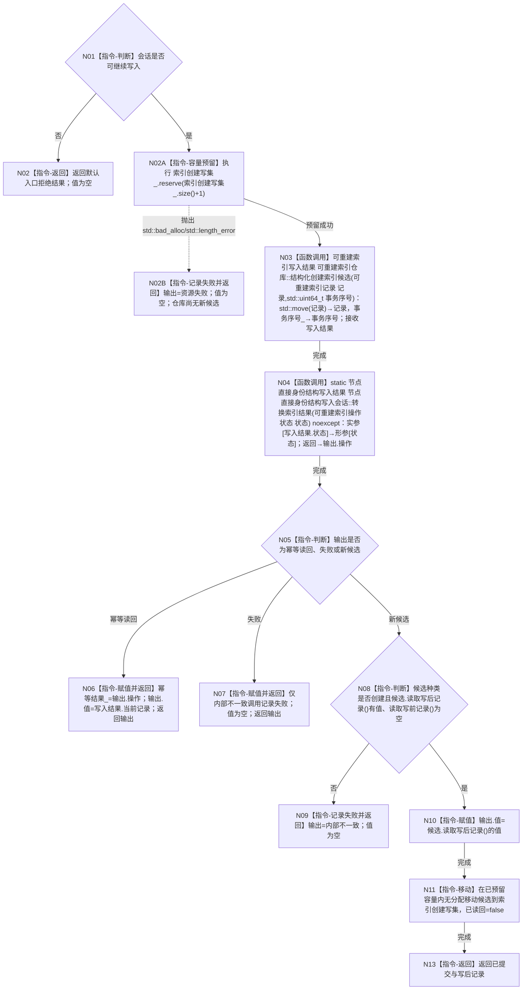

# CORE-RETIRE-P1 CR-F53 会话创建索引候选单函数施工流程图

更新时间：2026-07-30
版本：v0.1
代码基线：`57866ac5ca63235ed12da60f635d29f1aacd718b`

## 依据

```text
规范/详细设计/20260730_CORE-RETIRE-P1_函数功能确认_v0.1.md（CR-F53）
规范/详细设计/20260730_CORE-RETIRE-P1_逐函数逐节点实现分析_v0.1.md（CR-F53 N01—N08）
当前函数：海中鱼巣/核心/会话.节点直接身份结构写入.ixx:187
```

## 身份与边界

本图只对应 CR-F53。会话调用 CR-F52 后只能从候选写后访问器取得创建记录，不得读取已删除的旧单槽 `读取记录()`。

## 函数合同

```text
根函数：节点直接身份结构写入会话::创建索引候选
归属模块 / 文件 / 层级：海中鱼巣.核心.会话.节点直接身份结构写入 / 海中鱼巣/核心/会话.节点直接身份结构写入.ixx / 核心事务会话层
现有或待新增：现有公开成员原位改造
完整签名：节点直接身份带值结构写入结果<可重建索引记录> 节点直接身份结构写入会话::创建索引候选(可重建索引记录 记录)
参数：记录按值传入并移动给仓库；调用方不保留该实例所有权
返回结果：带值结构写入结果；已提交携带候选写后记录，幂等读回携带仓库当前记录，拒绝/失败不带值
所有权：仓库返回候选先由本函数局部拥有，成功后移动到会话索引创建写集；会话生命周期不越过执行器回调
非法值：会话不可继续、仓库入口拒绝/冲突、候选缺写后、候选种类非创建
错误语义：仓库内部不一致记录会话失败；写集分配失败立即撤销局部候选并返回资源失败
```

## 双向引用

- 调用者：写执行器回调和 CR-F47/T15、T23 专项夹具。
- 被调图：[CR-F52](20260730_CORE-RETIRE-P1_CR-F52_结构化创建索引候选单函数施工流程图_v0.1.md)；撤销失败收口引用 CR-F10。

## 流程图



## 节点合同

| 节点 | 类型 | 输入 / 输出绑定 | 事实读写 | 后继条件 | 验证 |
| --- | --- | --- | --- | --- | --- |
| N01/N05/N08 | 本函数内指令 | 会话/结果/候选 | 具名判断 | 只读本地与会话阶段 | 分支条件 | 创建种类与optional组合 |
| N02/N02B/N06/N07/N09/N13 | 本函数内指令 | 状态与记录 | 带值结构结果 | 至多记录会话失败 | 直接返回 | 值与状态一致 |
| N03 | 函数调用 | move(记录)、事务序号_ | 仓库写入结果 | 写隔离仓候选 | 调用完成 | CR-F52 |
| N04 | 函数调用 | 索引操作状态 | 会话写入结果 | 无仓库写 | 调用完成 | CR-F38 |
| N02A/N10/N11 | 本函数内指令 | 目标容量、写后optional、可移动候选 | 输出值、索引创建写集 | 先预留，后形成候选并无分配移动 | 移动完成 | 禁止旧 `读取记录()` |

## 关键边界

```text
输出创建值只能来自 `读取写后记录()`；不得回退到 `当前记录` 猜测候选写后，也不得调用旧单槽访问器。
写集分配只允许发生在仓库候选形成前；候选成功形成后只允许无分配移动并由会话唯一拥有。
```
