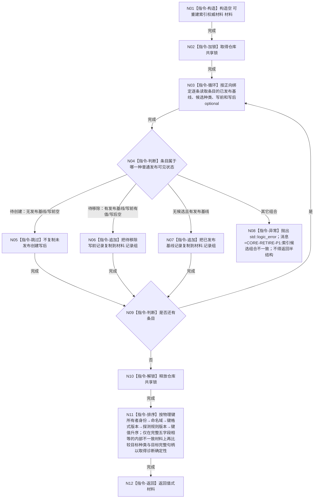

# CORE-RETIRE-P1 CR-F54 导出可丢弃加速材料单函数施工流程图

更新时间：2026-07-30
版本：v0.1
代码基线：`57866ac5ca63235ed12da60f635d29f1aacd718b`

## 依据

```text
规范/详细设计/20260730_CORE-RETIRE-P1_函数功能确认_v0.1.md（CR-F54）
规范/详细设计/20260730_CORE-RETIRE-P1_逐函数逐节点实现分析_v0.1.md（CR-F54 N01—N06）
当前函数：海中鱼巣/核心/仓库.可重建索引.ixx:297
```

## 身份与边界

本图只对应 CR-F54。导出必须与普通发布视图一致：待移除条目仍导出写前，待创建条目不导出；结果是调用方拥有的值式副本。

## 函数合同

```text
根函数：可重建索引仓库::导出可丢弃加速材料
归属模块 / 文件 / 层级：海中鱼巣.核心.仓库.可重建索引 / 海中鱼巣/核心/仓库.可重建索引.ixx / 冻结导出边界
现有或待新增：现有公开const成员原位改造
完整签名：可重建索引权威材料 可重建索引仓库::导出可丢弃加速材料() const
参数：无
返回结果：可重建索引权威材料；调用方拥有记录组副本；空发布视图返回空记录组
所有权：仓库只在复制期间持共享锁；返回后不保留锁、引用、候选或仓库内部指针
非法值：无入口参数；复制/排序的 `std::bad_alloc/std::length_error` 原样传播；仓库内部条目候选组合不满足合同时抛固定前缀 `CORE-RETIRE-P1:` 的 `std::logic_error`，不得导出半结构
错误语义：本函数不把候选阶段写入材料；只复制普通发布可见记录并确定性排序
```

## 双向引用

- 调用者：冻结导出与 CR-F47/T17、T27 专项夹具。
- 被调函数：无非平凡项目函数；只使用本函数内共享锁、遍历、复制与稳定比较指令。

## 流程图



## 节点合同

| 节点 | 类型 | 输入 / 输出 | 事实读写 | 后继条件 | 验证 |
| --- | --- | --- | --- | --- | --- |
| N01 | 本函数内指令 | 无 | 空材料 | 只写本地 | 构造完成 | 空仓合法 |
| N02/N10 | 本函数内指令 | 仓库锁 | 共享锁生命周期 | 只读仓库 | 取得/释放 | 锁不进入排序与返回 |
| N03/N04/N09 | 本函数内指令 | 正向条目 | 候选分类 | 只读仓库 | 循环/分支 | 普通视图裁决唯一 |
| N05—N08 | 本函数内指令 | 发布基线与optional组合 | 跳过/复制/拒绝 | 只写本地材料 | 分类完成 | 待移除见写前，待创建不可见 |
| N11 | 本函数内指令 | 记录组 | 确定顺序记录组 | 只写副本 | 排序完成 | 完整键与目标稳定次序 |
| N12 | 本函数内指令 | 材料 | 值式权威材料 | 无 | 无条件 | 不返回候选身份 |

## 关键边界

```text
候选期冻结导出必须与普通读取一致：待移除仍见发布写前，待创建仍不可见。
排序主序必须与 CR-F07/CR-F30/CR-F57 相同，固定覆盖物理键五字段 `(所有者身份,命名域,键格式版本,探测规则版本,键值)`；合法仓库不允许完整物理键重复，目标种类和对应完整句柄只作为内部不一致诊断的末级确定性键，不改变主序。
```
