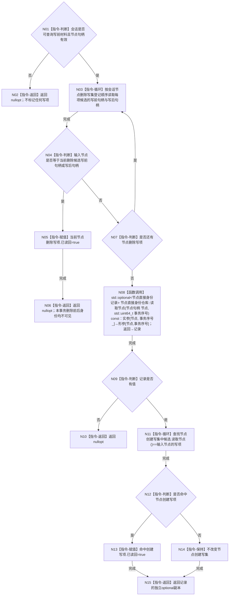

# CORE-RETIRE-P1 CR-F55 会话读取节点单函数施工流程图

更新时间：2026-07-30
版本：v0.1
代码基线：`57866ac5ca63235ed12da60f635d29f1aacd718b`

## 依据

```text
规范/详细设计/20260730_CORE-RETIRE-P1_函数功能确认_v0.1.md（CR-F55）
规范/详细设计/20260730_CORE-RETIRE-P1_逐函数逐节点实现分析_v0.1.md（CR-F55 N01—N08）
当前函数：海中鱼巣/核心/会话.节点直接身份结构写入.ixx:130
```

## 身份与边界

本图只对应 CR-F55。会话读取先裁决本事务节点删除写集；删除候选的写前或写后句柄均不可见且必须完成该删除写项读回，其他句柄才委托节点仓事务读取。

## 函数合同

```text
根函数：节点直接身份结构写入会话::读取节点
归属模块 / 文件 / 层级：海中鱼巣.核心.会话.节点直接身份结构写入 / 海中鱼巣/核心/会话.节点直接身份结构写入.ixx / 核心事务会话读取层
现有或待新增：现有公开成员原位改造
完整签名：std::optional<节点直接身份记录> 节点直接身份结构写入会话::读取节点(节点句柄 节点)
参数：节点按值传入；不转移所有权；无效句柄不可产生记录
返回结果：本事务可见节点记录的独立optional副本；删除写前/写后句柄、无效句柄或仓库未命中均返回nullopt
所有权：会话借用节点仓；返回记录由调用方拥有；删除/创建写集仍由会话拥有
非法值：会话不可查询写前材料、无效节点句柄、错仓/错版本或仓库未命中
错误语义：本事务删除候选命中是合法不命中并完成精确读回；其它仓库异常不得伪造成有效记录
```

## 双向引用

- 调用者：`读取节点稳定主键`、CR-F12 节点删除前置及 CR-F48/T30—T33 专项夹具。
- 被调函数：节点仓库事务读取 `读取节点(节点句柄, std::uint64_t)`；该仓库函数现有过程由其自身设计/现状证据承载。

## 流程图



## 节点合同

| 节点 | 类型 | 输入 / 输出 | 事实读写 | 后继条件 | 验证 |
| --- | --- | --- | --- | --- | --- |
| N01/N04/N07/N09/N12 | 本函数内指令 | 会话、句柄、候选或记录 | 具名判断 | 只读会话/本地 | 分支条件 | 写前写后均匹配 |
| N02/N06/N10/N15 | 本函数内指令 | 具名分支材料 | optional记录 | 无仓库写 | 直接返回 | 删除候选始终不可见 |
| N03/N11 | 本函数内指令 | 删除/创建写集 | 当前写项 | 只读写集 | 循环 | 登记顺序稳定 |
| N05/N13/N14 | 本函数内指令 | 命中结果 | 已读回标记或不变 | 只写精确写项 | 判断完成 | 不标记无关写项 |
| N08 | 函数调用 | 节点、事务序号_ | 节点记录副本 | 只读节点仓本事务视图 | 调用完成 | 其它句柄唯一读取路径 |

## 关键边界

```text
删除候选写前和写后句柄都返回nullopt；这保证本事务不会通过旧版本或待发布删除版本重新观察节点。
只有精确命中的删除或创建写项被标记已读回；普通已发布节点不污染写集读回状态。
```
