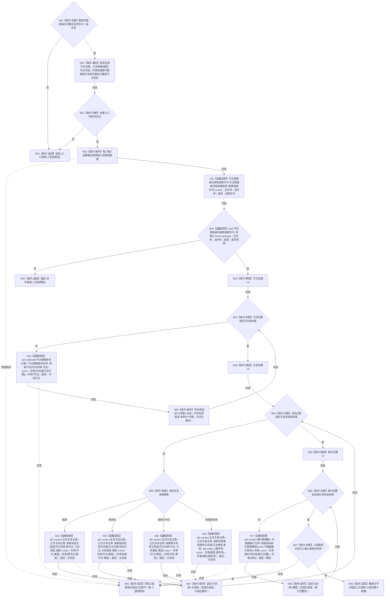

# CR-F56 读取服务批量读取单函数施工流程图

版本：v0.1
创建侧代码基线：`57866ac5ca63235ed12da60f635d29f1aacd718b`

## 函数合同

```text
根函数：节点直接身份结构读取服务::批量读取
归属：海中鱼巣.核心.执行器.节点直接身份结构写入 / 海中鱼巣/核心/执行器.节点直接身份结构写入.ixx
现有或待新增：待新增公开成员
完整签名：节点直接身份结构批量读取结果 节点直接身份结构读取服务::批量读取(const 节点直接身份结构批量读取请求& 请求) const
参数：请求为调用期只读借用，含节点组、关系查询组、索引目标组；至少一组非空
返回：外层已读取时三结果组与三输入组分别等长同序；入口/许可/内部错误时三结果组全空
所有权：服务构造期只借用事务域及节点、关系、索引三仓指针；结果全部为调用方自有值式副本
入口拒绝：空批；服务指针不完整；节点无效；关系种类/类型无效；按源/目标/相关节点的节点无效；按类型角色的节点反而有效；索引目标非完整节点目标
子结果：节点不存在=未命中+无值；关系/索引零命中=已读取+空 vector
```



双向引用：

- 单项包装调用者：[CR-F39](./20260730_CORE-RETIRE-P1_CR-F39_读取服务读取节点单函数施工流程图_v0.1.md)、[CR-F40](./20260730_CORE-RETIRE-P1_CR-F40_读取服务读取有效关系组单函数施工流程图_v0.1.md)、[CR-F41](./20260730_CORE-RETIRE-P1_CR-F41_读取服务读取指向有效关系组单函数施工流程图_v0.1.md)、[CR-F42](./20260730_CORE-RETIRE-P1_CR-F42_读取服务读取相关有效关系组单函数施工流程图_v0.1.md)、[CR-F43](./20260730_CORE-RETIRE-P1_CR-F43_读取服务读取有效类型角色关系组单函数施工流程图_v0.1.md)、[CR-F44](./20260730_CORE-RETIRE-P1_CR-F44_读取服务读取目标索引物理键组单函数施工流程图_v0.1.md)。
- 仓库被调图：CR-F21、CR-F01、CR-F02、CR-F03、CR-F30；调用顺序固定为节点输入顺序、关系输入顺序、索引输入顺序。

关键边界：全量入口校验必须发生在取得许可和读取任何仓库之前；一次批量仅取得一次共享许可。任一异常清空全部子结果，禁止返回半批；本函数不构造写会话、不取得独占许可。
