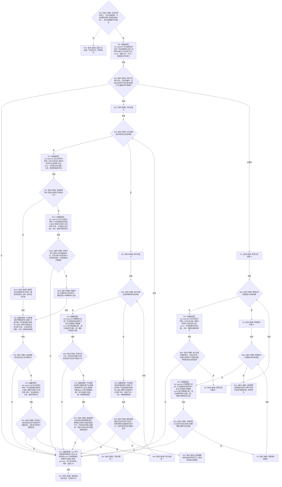

# CR-F57 登记核心节点退役候选单函数施工流程图

日期：2026-07-30
版本：v0.1
创建侧代码基线：`57866ac5ca63235ed12da60f635d29f1aacd718b`

## 身份与边界

本图只对应底层核心候选编排函数，不承担领域类型化记录退役，也不直接取得许可、确认、撤销或发布。具名领域服务在现有写执行器回调内先让领域参与者持有自己的退役候选，再调用本函数登记关系、索引和节点核心候选，最后由调用者请求提交。

## 函数合同

```text
根函数：节点直接身份结构写入会话::登记核心节点退役候选
归属模块 / 文件 / 层级：海中鱼巣.核心.会话.节点直接身份结构写入 / 海中鱼巣/核心/会话.节点直接身份结构写入.ixx / 核心结构会话编排层
现有或待新增：待新增公开成员
完整签名：节点直接身份核心退役候选结果 节点直接身份结构写入会话::登记核心节点退役候选(const 节点直接身份核心退役规格& 规格)
参数：规格为调用期只读借用；字段为节点句柄、待失效关系句柄组、待移除索引物理键组；关系组按 `(仓库编号,关系编号,版本号)` 严格升序且相邻稳定身份 `(仓库编号,关系编号)` 不得相同；索引组按 `(所有者身份,命名域,键格式版本,探测规则版本,键值)` 字典序严格升序且无重复
返回结果：节点直接身份核心退役候选结果；含结构化操作结果和成功时的节点写后句柄
所有权：输入组归调用方；关系/索引/节点候选唯一移入会话六写集；返回只含值式结果
入口拒绝：会话不可写、节点无效、组未排序/重复、关系不属于目标节点、索引不是目标节点索引
内部错误：任一候选前置通过后读回、身份或版本不一致；函数记录首次失败，使执行器统一撤销
```



## 节点合同

| 节点 | 类型 | 输入 / 输出 | 事实读写 | 后继条件 | 验证 |
| --- | --- | --- | --- | --- | --- |
| N01—N02 | 本函数内指令 | 值式规格 | 零写 | 输入完整 | 排序、稳定身份唯一、句柄 |
| X00/B00 | 函数调用 / 判断 | `规格.节点→节点`；`目标节点审计←optional<节点直接身份记录>` | 只读节点审计 | 有效进入候选路径；已删除进入幂等短路 | 新候选/已发布幂等分流 |
| IX01—IR01 | 函数调用 / 指令 | 关系/索引规格项及节点审计当前记录 | 只读正式发布审计和本事务索引视图 | 每项均已是目标后态 | 无变化退役不调用 CR-F12、不推进版本 |
| X01—X03/B02—B04 | 函数调用 / 判断 | 关系句柄、普通发布审计、本事务审计及期望写前/写后 | 关系失效候选写集 | 输入为写前句柄时由普通审计证明关联目标；输入为本事务写后句柄时由事务审计历史末项证明关联目标；两者均回显同一确定后态 | T10、T35、T42、T45 |
| X04—X05/B06—B07 | 函数调用 / 判断 | 索引键与写前记录 | 索引移除写集 | 本事务不命中且写前回显一致 | T20、T35、T42、T45 |
| X06/B08 | 函数调用 / 判断 | 目标节点 | 节点删除写集 | F12 最终复核不存在遗漏关系/索引 | T28—T34 |
| E01 | 函数调用 / 返回 | 首个失败 | 记录会话失败 | 执行器必须撤销 | 零半提交 |
| R02 | 本函数内指令 | 删除结果 | 值式输出 | 无条件 | 不请求提交 |

## 双向引用

- 业务节点：B06—B14。
- 直接被调图：[CR-F12](./20260730_CORE-RETIRE-P1_CR-F12_会话删除节点候选单函数施工流程图_v0.1.md)、[CR-F13](./20260730_CORE-RETIRE-P1_CR-F13_会话移除索引候选单函数施工流程图_v0.1.md)、[CR-F25](./20260730_CORE-RETIRE-P1_CR-F25_普通读取关系审计单函数施工流程图_v0.1.md)、[CR-F34](./20260730_CORE-RETIRE-P1_CR-F34_会话读取索引物理键单函数施工流程图_v0.1.md)、[CR-F58](./20260730_CORE-RETIRE-P1_CR-F58_登记关系候选单函数施工流程图_v0.1.md)（经现有 `失效关系候选`）。
- 复用现有入口：节点仓 `读取节点审计(节点句柄) const`、会话 `读取关系审计(关系句柄)`（其内部调用 CR-F26）、`失效关系候选(关系句柄)`、`记录失败(...)`。

## 关键边界

```text
本函数只编排核心节点、关系和可丢弃索引候选，不验证或退役领域类型化记录。
领域服务必须用现有写执行器的参与者组在同一事务中承载领域记录退役；没有具名领域参与者的业务节点不得把本函数当成完整业务删除许可。
本函数不调用 请求提交()，调用者只有在全部领域参与者材料也已准备后才能请求提交。
```
