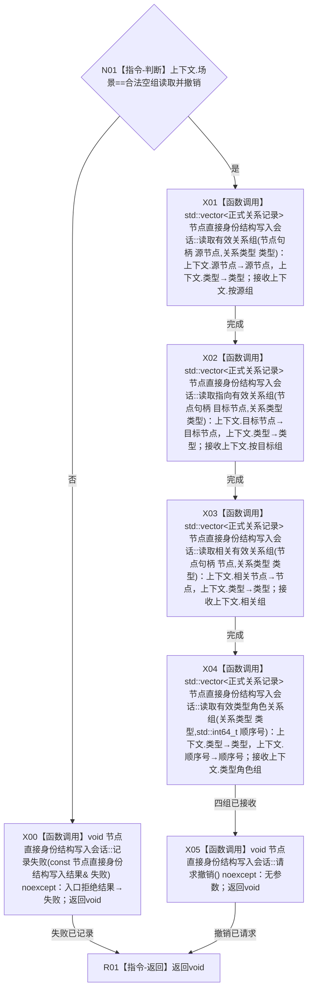

# CR-F59 执行关系枚举会话回调单函数施工流程图

版本：v0.1
代码基线：`57866ac5ca63235ed12da60f635d29f1aacd718b`

## 函数合同

```text
根函数：执行关系枚举会话回调
物理位置：海中鱼巣/核心/自检.节点直接身份结构写入.ixx，CR-F45 之前内部区
完整签名：void 执行关系枚举会话回调(关系枚举会话回调上下文& 上下文, 节点直接身份结构写入会话& 会话)
参数：上下文和会话均为一次执行期可写借用，不保存；场景只允许合法空组读取并撤销=1
返回：void；四组值式结果写入上下文；失败由会话结构结果承载
```



调用者：CR-F45 通过 `std::bind_front(执行关系枚举会话回调,std::ref(上下文))` 传入现有执行器。被调方图：CR-F22、F04、F05、F06。
