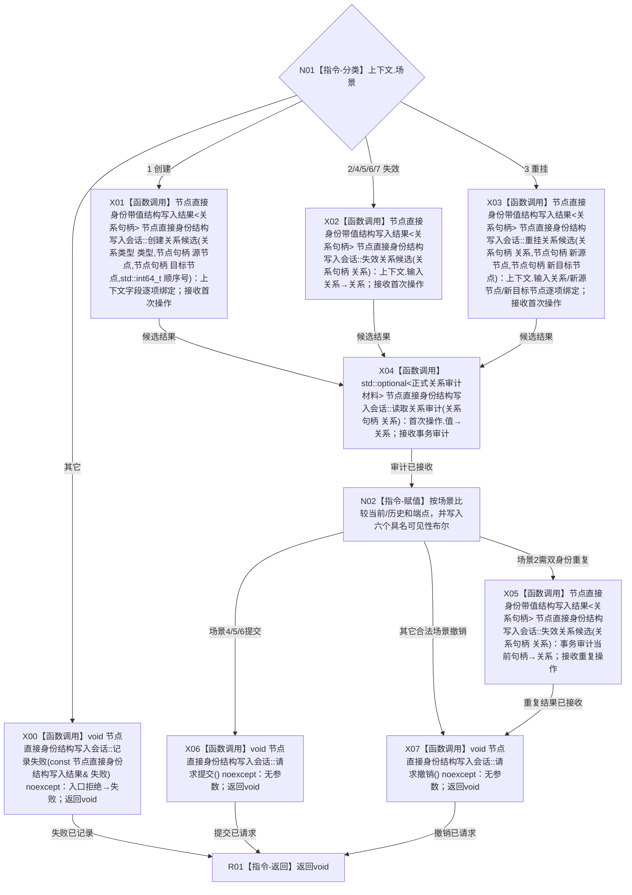

# CR-F60 执行关系候选隔离会话回调单函数施工流程图

版本：v0.1
代码基线：`57866ac5ca63235ed12da60f635d29f1aacd718b`

## 函数合同

```text
根函数：执行关系候选隔离会话回调
物理位置：海中鱼巣/核心/自检.节点直接身份结构写入.ixx，CR-F46 之前内部区
完整签名：void 执行关系候选隔离会话回调(关系候选隔离会话回调上下文& 上下文, 节点直接身份结构写入会话& 会话)
参数：两项均为一次执行期借用；场景固定1—7，字段适用性见函数功能确认§2.13
返回：void；操作结果、审计和可见性证据写入上下文；提交/撤销决定写入会话
```



调用者：CR-F46；绑定方式为 `std::bind_front(执行关系候选隔离会话回调,std::ref(上下文))`。公开会话入口内部间接调用 CR-F58，本回调不得直接调用 CR-F58。
