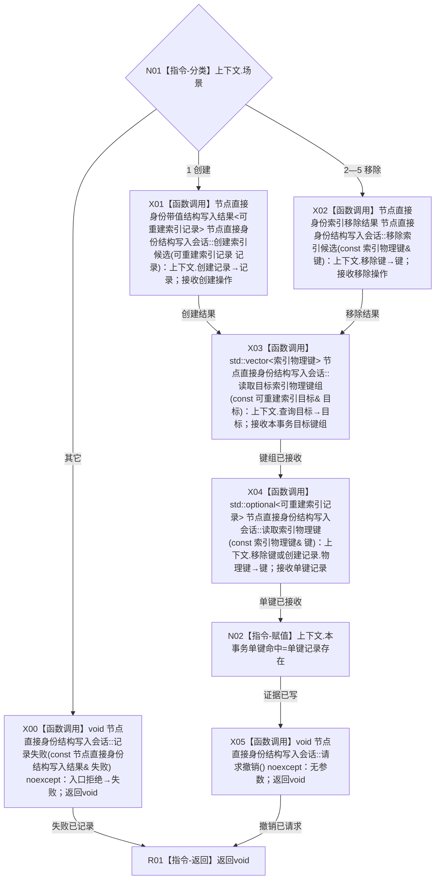

# CR-F61 执行索引候选会话回调单函数施工流程图

版本：v0.1
代码基线：`57866ac5ca63235ed12da60f635d29f1aacd718b`

## 函数合同

```text
根函数：执行索引候选会话回调
物理位置：海中鱼巣/核心/自检.节点直接身份结构写入.ixx，CR-F47 之前内部区
完整签名：void 执行索引候选会话回调(索引候选会话回调上下文& 上下文, 节点直接身份结构写入会话& 会话)
参数：一次执行期借用；场景1—5；不适用字段不得被读取
返回：void；创建/移除结果、目标键组和单键命中证据写上下文；所有场景显式撤销
```



调用者：CR-F47；绑定方式为 `std::bind_front(执行索引候选会话回调,std::ref(上下文))`。直接被调图：CR-F53、F13、F07、F34。
