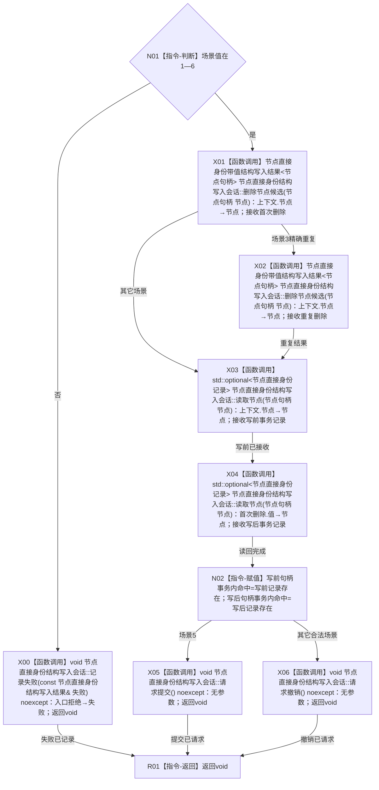

# CR-F62 执行节点删除会话回调单函数施工流程图

版本：v0.1
代码基线：`57866ac5ca63235ed12da60f635d29f1aacd718b`

## 函数合同

```text
根函数：执行节点删除会话回调
物理位置：海中鱼巣/核心/自检.节点直接身份结构写入.ixx，CR-F48 之前内部区
完整签名：void 执行节点删除会话回调(节点删除会话回调上下文& 上下文, 节点直接身份结构写入会话& 会话)
参数：一次执行期借用；场景1—6、目标节点
返回：void；首次/重复删除及写前/写后事务命中写上下文；场景5提交，其它撤销
```



调用者：CR-F48；绑定方式为 `std::bind_front(执行节点删除会话回调,std::ref(上下文))`。关系/索引残留夹具由 F48 外层在执行前建立，普通发布后审计也由外层完成。
