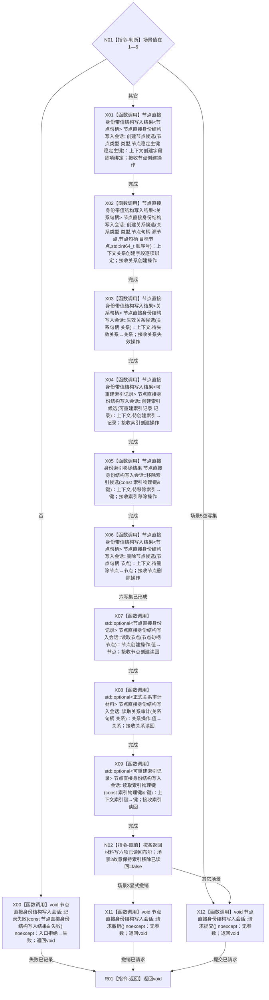

# CR-F63 执行六写集故障会话回调单函数施工流程图

版本：v0.1
代码基线：`57866ac5ca63235ed12da60f635d29f1aacd718b`

## 函数合同

```text
根函数：执行六写集故障会话回调
物理位置：海中鱼巣/核心/自检.节点直接身份结构写入.ixx，CR-F49 之前内部区
完整签名：void 执行六写集故障会话回调(六写集故障会话回调上下文& 上下文, 节点直接身份结构写入会话& 会话)
参数：一次执行期借用；场景1—6；六类具名输入字段
返回：void；六类操作和六项精确读回布尔写上下文；参与者由F49外层传执行器，回调不持有参与者
```



调用者：CR-F49；绑定方式为 `std::bind_front(执行六写集故障会话回调,std::ref(上下文))`。场景4的撤销失败由 F49 外层参与者实现，回调本身不拥有参与者。
