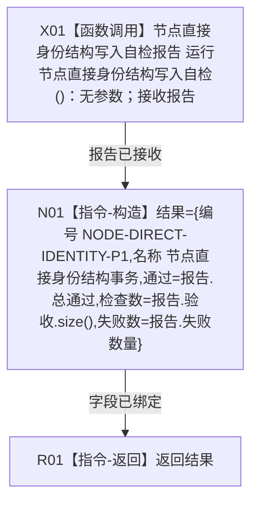

# CR-F64 运行节点直接身份结构事务自检单元单函数施工流程图

版本：v0.1
代码基线：`57866ac5ca63235ed12da60f635d29f1aacd718b`

## 函数合同

```text
根函数：运行节点直接身份结构事务自检单元
物理位置：海中鱼巣/启动.应用程序.ixx，CR-F51 运行完整自检模式之前内部区
完整签名：自检单元结果 运行节点直接身份结构事务自检单元()
参数：无
返回：值式自检单元结果；编号、名称、通过、检查数、失败数全部由常量和专项报告显式形成
```



调用者：CR-F51 以函数指针 `&运行节点直接身份结构事务自检单元` 登记。被调方：[CR-F20](./20260730_CORE-RETIRE-P1_CR-F20_运行节点直接身份结构写入专项源码自检单函数施工流程图_v0.1.md)。
