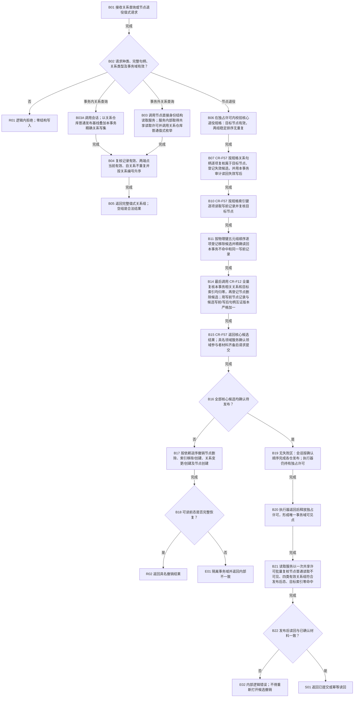

# CORE-RETIRE-P1 关系反向读取与节点退役事务业务流程图

日期：2026-07-30
版本：v0.1
性质：目标业务流程图；代码尚未实现

## 0. 依据与互引

```text
规范/4010_子规范_统一仓库稳定句柄与通用关系索引边界.md
规范/4030_子规范_事务边界与并发纪律.md
规范/4040_子规范_原子发布恢复与故障隔离.md
规范/4070_子规范_新域冻结恢复与可丢弃索引边界.md
流程图/主程序可达调用关系/能力证据目录/当前能力证据目录.md
规范/详细设计/20260730_CORE-RETIRE-P1_函数功能确认_v0.1.md
规范/详细设计/20260730_CORE-RETIRE-P1_逐函数逐节点实现分析_v0.1.md
规范/详细设计/20260730_CORE-RETIRE-P1_关系反向读取与核心节点退役事务详细设计_v0.1.md
规范/详细设计/函数结构知识图谱/20260730_CORE-RETIRE-P1_函数结构知识图谱_v0.1.md
计划/过期计划/20260730_CORE-RETIRE-P1_关系反向读取与核心节点退役事务底座代码实施切片_v0.1.md
```

## 1. 业务闭环

输入是具名领域数据操作已经复核的关系查询条件，或由具名领域服务冻结的 `节点直接身份核心退役规格`。退役规格显式列出目标节点、待失效关系句柄组和待移除索引物理键组；领域类型化记录由同一写执行器参与者组另行承载。输出只能是值式关系组、结构化拒绝、核心候选结果、完整事务提交结果或内部错误；不得输出锁、许可、会话、候选对象或仓库引用。



## 2. 节点—能力—函数映射

| 业务节点 / 辅助切片 | 所需能力合同 | 当前候选能力与证据 | 裁决 | 目标函数组 | 事实读写 | 验证 |
| --- | --- | --- | --- | --- | --- | --- |
| B03—B05 | 事务外一次共享许可读取；事务内发布基线叠加精确写集 | 新节点仓已有普通/事务节点读取；新关系仓只有按源读取；能力目录 CAP-0011 是旧关系栈，不可跨域复用 | 节点读取直接复用；按源读取扩展；按目标/相关/类型角色新增；会话组合候选写集；读取服务新增批量适配 | CR-F01—CR-F06、CR-F21—CR-F23、CR-F39—CR-F43、CR-F56 | 只读关系、节点端点、读取许可 | 普通/事务、空组、自关系、稳定排序、许可拒绝 |
| B06—B14 | 按值式规格登记完整核心退役候选 | 节点仓已有删除候选；关系仓已有失效候选；新索引仓无移除生命周期；能力目录 CAP-0012/CAP-0019/CAP-0029 属旧栈或证据不足 | 节点删除复用仓库能力并扩展会话；关系失效扩展幂等与审计；索引移除新增；CR-F57 组合三者 | CR-F05、CR-F07、CR-F08、CR-F12、CR-F13、CR-F17、CR-F25、CR-F26、CR-F30、CR-F31、CR-F34、CR-F38、CR-F55、CR-F57、CR-F58 | 关系发布基线/历史/失效候选、索引正反绑定/移除候选、节点删除候选 | 规格稳定身份唯一；每项属于目标节点；漏项由 F12 最终拒绝；候选精确读回；同事务精确重复不形成第二候选 |
| B15—B19 | 全写集读回、确认、逆序撤销、最后发布 | 现有新执行器具备节点创建、关系创建及索引创建顺序，但无索引移除/节点删除会话写集 | 扩展现有会话与执行器，不另建事务域或锁协议 | CR-F09—CR-F11、CR-F14、CR-F15、CR-F18、CR-F19、CR-F28、CR-F35—CR-F37 | 节点、关系、索引精确写集 | 候选错仓/错事务拒绝、固定正序确认与发布、完全逆序撤销、撤销失败隔离 |
| B20—B22 | 释放独占许可后经一次批量读取完成权威读回 | 新事务域已有共享读取许可；当前无跨三仓批量值式服务 | 复用许可；新增批量服务和六个单项适配入口 | CR-F39—CR-F44、CR-F56 | 已发布节点、四类关系普通枚举、索引 | 单一共享许可统一可见点、零半结构 |
| 既有创建/审计/冻结兼容（非业务节点） | 本包结构变化不得破坏新关系、新索引既有创建、审计、重建和冻结 | 当前 CR-F16/F24/F27/F32/F33/F52/F53/F54 对应函数真实存在 | 原位适配新候选结构，不改变业务语义 | CR-F16、CR-F24、CR-F27、CR-F32、CR-F33、CR-F52—CR-F54 | 既有创建、审计、重建、冻结事实 | 兼容矩阵和静态接口核对 |
| 专项验证（非生产业务节点） | 固定覆盖本包新增与兼容分支；日志不参与裁决 | 现有专项自检27项和完整自检模式16项 | 扩展为74项专项和17项完整模式；只在正式自检入口执行 | CR-F20、CR-F45—CR-F51 | 隔离夹具、人读报告、完整自检结果 | T01—T47、V48、日志关闭零求值 |

## 3. 完成边界

本图只冻结新直接身份核心三仓的候选生产与事务闭环。CR-F57 是底层原语提供者，不是完整业务删除许可：带有领域类型化记录的节点必须由具名领域服务在同一现有写执行器参与者组内先建立领域退役候选，才能请求提交。领域参与者实现和完整冻结恢复属于后继独立设计包。本包不修改参与者 ABI，不建立无类型通用值仓。

专项自检不在每次生产退役事务后运行；它只由正式自检模式 CR-F51 调用。生产业务成功在 B22 后直接返回 S01。
