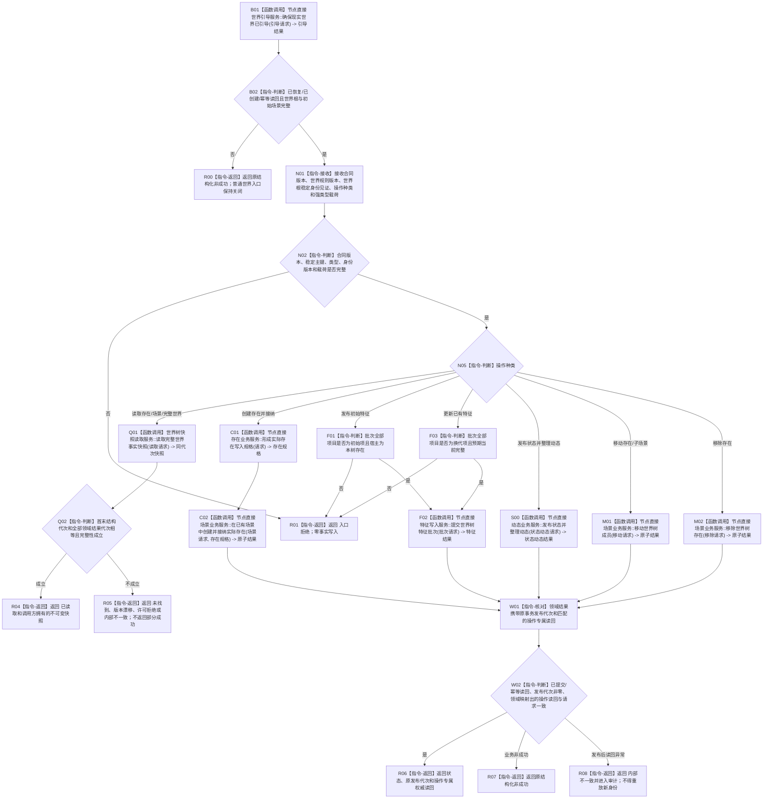

# WORLD-TREE-P1 世界树业务服务业务流程图 v0.1

更新时间：2026-08-02

## 依据

```text
用户目标：建立统一世界树业务门面，覆盖引导、查询、创建、特征初始/换代、状态动态、移动和完整快照
正式规范：0050、4020—4070、4170—4200
当前代码基线：012f49eb32709e47b5b7b44d464f57cb70ff9526
当前提供者：新直接身份节点/关系/索引/事务底座；旧存在/场景/特征/状态/动态服务只属于旧结构栈
当前缺口：关系稳定身份、内存发布代次见证、纯值式 L1 提交服务、新域世界引导/领域提供者、分服务代次读取、归属原子重挂
```

## 身份与边界

本图冻结一个闭环：启动期先恢复或首次引导现实世界，随后调用方通过 `世界树业务服务` 对具名世界读写并取得可验证结果。它不表示代码已经实现，不替代详细设计。

## 流程图



## 业务节点—能力—目标函数映射

| 节点 | 所需能力 | 当前证据 | 裁决 | 目标函数 / 物理位置 |
| --- | --- | --- | --- | --- |
| B01 | 空域恢复或首次建立现实世界根和初始场景 | 新直接身份域无正式生产世界根来源 | 新建 | `节点直接世界引导服务::确保现实世界已引导` / `领域/服务.节点直接世界引导.ixx` |
| Q01 | 具名服务分次读取并以发布代次证明同代次 | 当前无公开发布代次见证和节点直接世界读取服务 | 新建 | `世界树快照读取服务::读取完整世界事实快照`，内部调用 `节点直接世界结构读取服务::读取世界结构` |
| C01 | 存在所有者形成不可变创建规格 | 旧结构栈入口不可用于新稳定身份域 | 新建 | `节点直接存在业务服务::形成实际存在写入规格` / `领域/服务.节点直接存在.ixx` |
| C02 | 创建存在与归属同事务 | 新直接身份底座存在，L2 世界结构提供者不存在 | 新建 | `节点直接场景业务服务::在已有场景中创建并接纳实际存在` / `领域/服务.节点直接场景.ixx` |
| F02 | 初始/换代批次发布 | 节点直接特征合同已有设计但当前稳定身份适配入口未实现 | 依赖提供者 | `节点直接特征写入服务::提交世界树特征批次` |
| S00 | 服务自行确定唯一相邻前状态并发布状态/动态 | 当前旧状态接口缺特征/特征值/来源存在，4180 注册比较服务也未实现 | 新建并依赖提供者 | `节点直接动态业务服务::发布状态并整理动态`；无前状态为基准态，等价只发后状态，合法差异同事务发布迁移动能 |
| M01/M02 | 关系失效、重挂、单父无环 | 核心有内部关系能力但缺关系稳定身份和节点直接场景提供者 | 扩展 | `节点直接场景业务服务::移动世界树成员`、`移除世界树存在` |
| W01/W02 | 原事务最后发布后的操作专属读回 | 当前执行器返回时即释放许可且无稳定身份值式读回规格 | 扩展 | 提交服务调用数据操作，数据操作形成中性规格，执行器固定事务窄入口完成写前准备、固定参与者发布、代次推进和原许可内通用读回；L2 只映射操作结果 |

## 事务和事实边界

```text
读取：首次世界结构代次 -> 具名特征/状态/动态服务分次读取 -> 末次世界结构代次 -> 全部代次相等则发布；不等则完整重试一次
写入：世界树门面单次委托具名领域事实所有者 -> 领域服务在自己的写前读取中验证世界结构并形成预期事实截止代次、请求意图摘要、执行证据摘要和 L1 纯值式版本化写集 -> L1 提交服务把公开请求交给唯一数据操作 -> 数据操作形成中性规格 -> 执行器独占许可内复核幂等/代次并只读计算计划稳定身份/预计代次/确定性材料 -> 持久证据写前准备 -> 内部固定参与者建立候选/确认 -> 逆序撤销边界 -> 最后发布新代次 -> 独占许可释放前按通用对象读回项形成值式材料 -> 领域服务映射操作读回 -> 门面映射统一结果
并发：许可竞争立即返回，不等待、不 sleep、不重试；只有完整快照的代次漂移允许整轮重试一次
SQL：仅持久证据、恢复候选、应急审计和交互投影；不参与 B01 之后普通读写的运行期裁决
```

## 完成条件

1. 引导和九类公开能力全部由强类型函数覆盖，世界树门面不持仓库、SQL、锁、令牌、会话、参与者或事务视图。
2. 完整快照恰好来自一个非零事实截止代次，许可竞争立即返回、代次漂移最多完整重试一次，缺项不返回部分成功。
3. 场景结构始终保持单根、单父、无环，存在在同一世界最多一个当前位置。
4. 所有写入口携带原事务发布代次和操作专属权威读回；不得用事务释放后的普通快照证明原提交。
5. 所有旧 `世界服务.h` 真实调用者已迁移后，同一生产切换中删除头文件、include、成员、构造和工程登记，不保留兼容壳。
