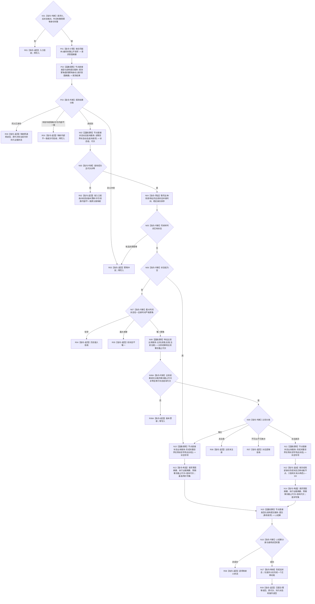

# 发布状态并整理动态目标函数流程图 v0.1

更新时间：2026-08-02

## 依据

```text
正式规范：1160、1170、4180、4200、4210、4220
函数合同：WORLD-TREE-P1 函数功能确认 2.6
依赖：P1A2 L1 查询/提交服务、P1A3 世界结构提供者、节点直接特征查询提供者、4180 当前唯一比较提供者
```

## 身份与边界

本图只描述状态发布后状态迁移动能整理；v1 不接受来源动作，不创建动作致变动态。

## 函数合同

```text
根函数：节点直接动态业务服务::发布状态并整理动态
归属：海中鱼巣.领域.服务.节点直接动态 / 海中鱼巣/领域/服务.节点直接动态.ixx / L2
待新增：是
完整签名：节点直接状态动态发布结果 发布状态并整理动态(const 世界树状态动态请求& 请求) const
参数：`请求: const 世界树状态动态请求&`，输入、只读借用，仅同步调用有效；调用方拥有世界头、后状态完整端点和唯一整理幂等身份，服务不保存引用
非法值：合同/规则版本不支持、世界根或任一端点身份不完整、发生时间为0、来源存在缺失或跨世界；DTO 不提供前状态/来源动作/动态身份，任何旁路材料均不得接收
返回：`节点直接状态动态发布结果` 调用方拥有的纯值；已提交/幂等读回含非零原代次、持久状态、后状态及至多一个迁移动能；13 个逻辑/内部状态按函数确认 2.6 精确分类，不抛异常
被调函数流程图：提交根见 `20260802_节点直接类型化结构提交服务提交_函数流程图_v0.1.md`；状态写项形成和 4180 比较的完整合同见函数确认 2.6
```

## 流程图



## 节点合同

| 节点组 | 类型 | 事实读写 | 验证 |
| --- | --- | --- | --- |
| N01/P01—P03 | 指令 / 函数调用 | 完整公开请求 -> 意图摘要 -> 内存幂等探测 | 同义先行返回，不受后来比较注册变化影响 |
| N02—N09 | 指令 / 函数调用 | 只读状态、特征和比较注册 | 无写入；零状态为成功空组；前状态唯一且时间严格追加；比较代次必须等于查询代次 |
| N10—N14 | 函数调用 / 指令 | 形成纯值写项，不触碰仓库 | 局部身份、来源、角色和预期代次固定 |
| N15 | 函数调用 | 原子发布状态及可选迁移动能 | L1 图双向引用 |
| N16—R09 | 指令 / 返回 | 只映射值式结果 | 全13状态映射，不伪造来源动作 |

## 关键边界

```text
不同幂等键并发基于同一前态时，第二笔由预期事实截止代次返回版本漂移。
角色3固定为特征定义；动态时间等于后状态时间；类型化值来源固定为来源存在。
动作致变动态由4220独立入口后继形成。
```
